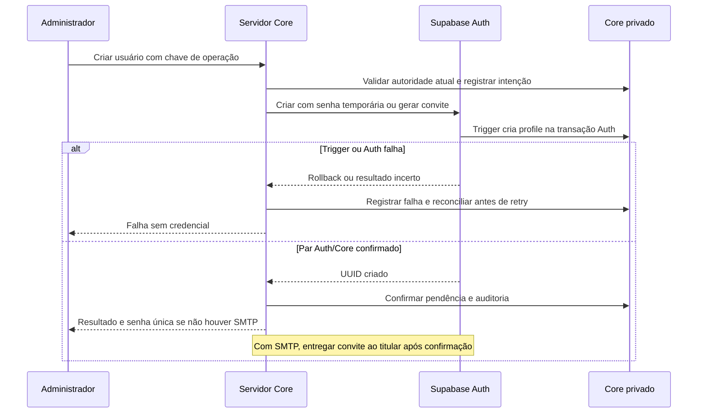
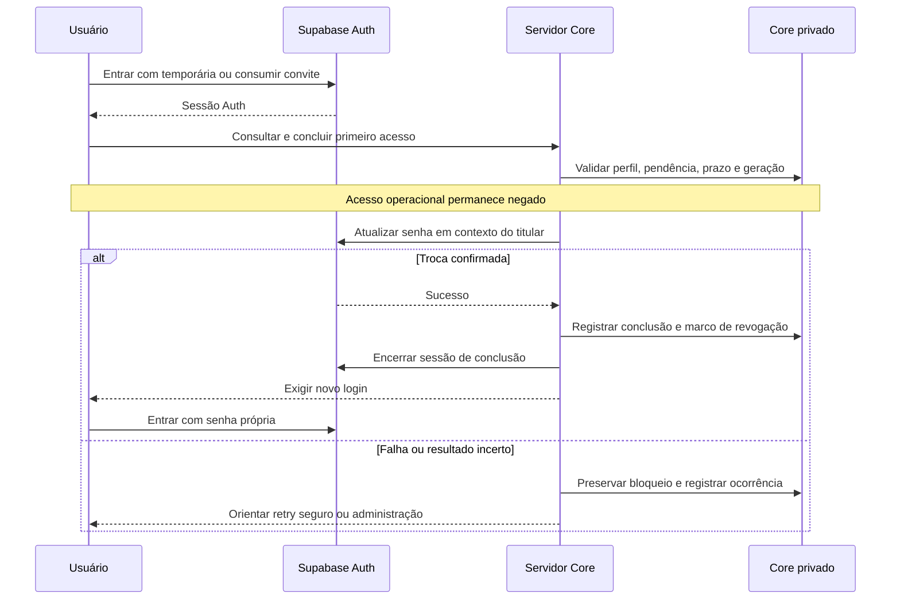
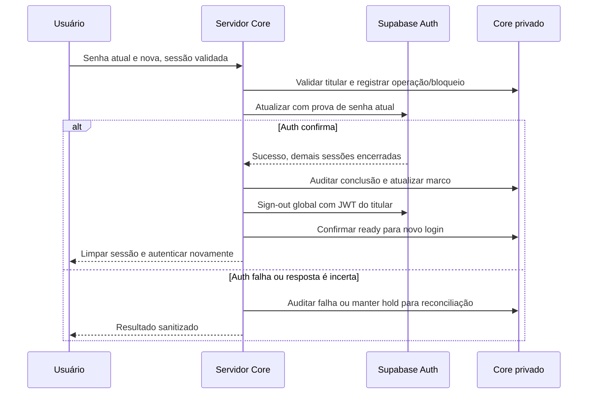
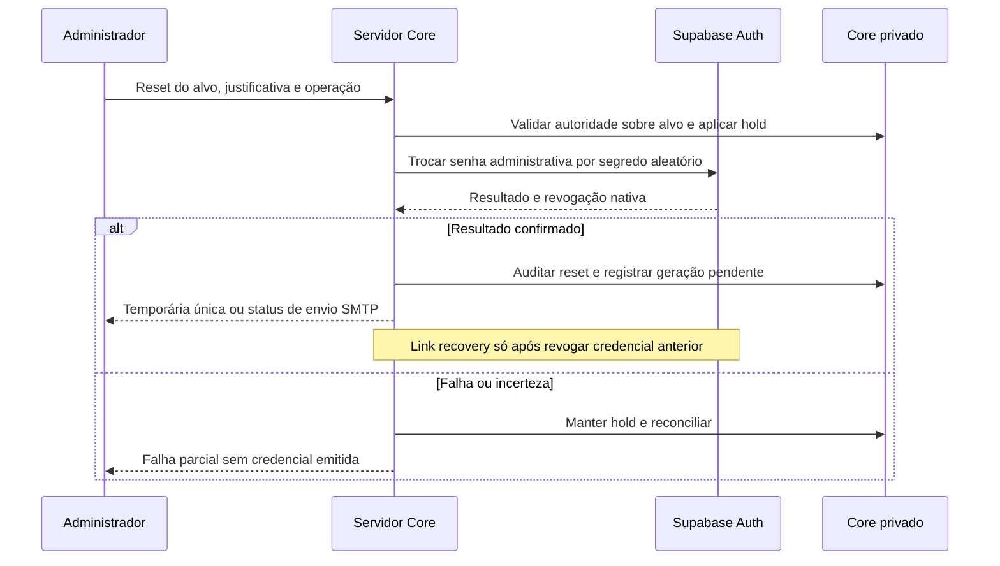
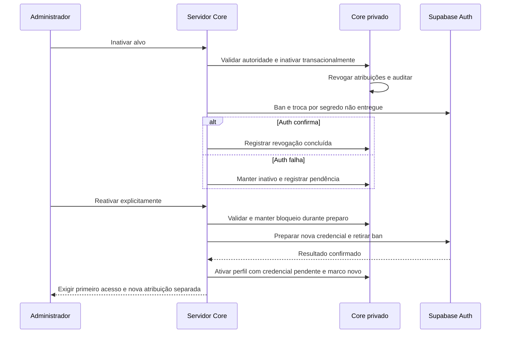

# Core Account Lifecycle v1

- Status: **DESIGN ONLY — proposta pendente de aprovação do PO**
- Data: 2026-10-08
- Brief: [CORE_ACCOUNT_LIFECYCLE_V1.md](../briefs/CORE_ACCOUNT_LIFECYCLE_V1.md)
- Base funcional do brief: `d2e30774eb7ab354f13edc7968a5b47f1d2a0891`
- Snapshot inspecionado: `bc53ddaaf0473d66226f15712d9d071b82e66ead`
- Branch de documentação: `docs/core-account-lifecycle-v1`
- Integração futura prevista pelo brief: `integration/core-foundation-v2`

## 1. Objetivo, autoridade e limites

Definir um lifecycle operacional de identidade no Core, com criação administrativa, credenciais, recuperação e revogação rastreáveis, compatível com Supabase self-hosted. Este documento não aprova implementação nem altera ADRs aceitos. Toda recomendação de produto sujeita ao PO está identificada por `PO-xx` na seção 14.

Invariantes de [ADR-005](../decisions/ADR-005-core-authorization.md), [AUTHORIZATION.md](AUTHORIZATION.md) e [SECURITY.md](SECURITY.md):

- Supabase Auth autentica; `auth.users.id` é a identidade canônica e corresponde a `core.profiles.id` em relação 1:1.
- Perfil ativo, permissão, escopo da atribuição e regra do recurso continuam necessários. Autenticação sozinha não concede acesso.
- Administração exige autorização atual em camada confiável. Não usar nome de role, claims antigas ou `user_metadata` como autorização.
- Browser nunca recebe service role, JWT secret, senha de banco ou credenciais SMTP, inclusive em erros, mapas de código, resposta HTTP ou configuração pública.
- Senhas e tokens usam mecanismos do Auth. Core não armazena senha, hash de senha nem cópia de credencial temporária.
- Inativação preserva identidade e histórico; exclusão física não é o lifecycle ordinário.
- Core não depende de módulo de negócio. Trilha de segurança é `core.system_audit_log`, distinta do domínio de auditorias de Qualidade.

Única entrega desta branch: este documento. Não há implementação, migrations, RPCs, alterações de RLS, configuração, Edge Functions, dependências, telas ou deploy. As estruturas e controles futuros descritos abaixo precisam de brief de implementação próprio após decisões do PO.

## 2. Estado atual verificado

| Fato | Evidência no snapshot | Consequência para o desenho |
| --- | --- | --- |
| Auth fornece login por e-mail/senha | `apps/web/src/core/auth/Login.tsx`: `signInWithPassword` | Reusar o provedor; não criar autenticação paralela. |
| Cadastro público desabilitado | `supabase/config.toml`: `[auth].enable_signup=false`; Compose: `GOTRUE_DISABLE_SIGNUP=true` | Criação somente por caminho administrativo. `[auth.email].enable_signup=true` habilita o provedor e não revoga o bloqueio global. |
| Não existem fluxos na aplicação para criar conta, recuperar ou trocar senha | Login encaminha acesso/reset à administração; `App.tsx` não contém essas rotas; API administrativa não chama Auth Admin | Login existente não é evidência de lifecycle implementado. |
| Há gestão de perfis e atribuições | `apps/web/src/core/admin/api.ts`: atualização de `profiles.active`, atribuição e revogação | Não substituir o modelo de administração nem ampliar autoridade com service role. |
| Perfil nasce automaticamente no insert Auth | `202609240001_core_foundation.sql`: trigger `create_core_profile` chama `private.create_profile` | Auth user e profile são criados na mesma transação de banco; não fazer segundo insert de profile na aplicação. |
| Perfil inicial tem `active=true`, sem roles implícitas | Defaults e trigger da mesma migration | Ativo não significa pronto nem autorizado; ausência de atribuição nega acesso operacional. |
| Inativação revoga atribuições | Trigger `revoke_deactivated_user` define `active=false` nas atribuições ativas | Reativar perfil não restaura acessos anteriores automaticamente. |
| Autoridade de gestão é mais restrita que uma permissão isolada | `202609240003_revocation_authority.sql`: `private.can_manage_profile` e `private.can_revoke` | Não ignorar restrição de autoalteração nem autoridade sobre permissões/escopos do alvo. |
| Sessão e ativação são separadas | `AuthProvider.tsx`, `App.tsx` e helpers SQL; UI atualiza acesso a cada 60 s e ao voltar à aba | Polling é UX; negação real acontece no banco. Perfil inativo pode continuar com sessão tecnicamente válida. |
| Frontend admite somente chave pública | `apps/web/src/core/client.ts`: publishable ou JWT com role `anon` | Manter essa fronteira; o teste no client não substitui isolamento de segredos no build/runtime. |
| Não há SMTP configurado na stack versionada | `supabase/config.toml`, `infra/supabase/docker-compose.yml`, exemplos de ambiente staging/production | Sem recuperação automática por e-mail nesta configuração. Isso não prova ausência de SMTP em ambiente externo não inspecionado. |
| Stack self-hosted é mínima | `infra/supabase/UPSTREAM.md` e Compose: db, kong, auth, rest, storage; Auth `v2.196.0`; JWT 3600 s | Functions/runtime de Edge não está disponível. Exemplos de produção são indefinidos, não provisionamento. |
| SDK declarado pode anteceder APIs novas | `apps/web/package.json`: `@supabase/supabase-js` `^2.89.0` | Verificar versão efetivamente resolvida antes de depender de `current_password`; não atualizar nesta branch. |

A base do brief e o snapshot da branch diferem apenas pelo commit que adicionou o próprio brief. A análise não incorpora outras branches em andamento.

## 3. Alternativas e recomendação

| Alternativa | Benefício | Limite | Recomendação |
| --- | --- | --- | --- |
| Browser chama Auth Admin | Menos infraestrutura | Expõe poder administrativo e bypass de RLS | Proibida. |
| Edge Function self-hosted de identidade | Caminho confiável compatível com Supabase | Exige adicionar runtime, rotas, segredos, logs e operação ausentes da stack | Possível alternativa futura, sujeita a `PO-01` e desenho de infraestrutura. |
| Endpoint Core em servidor confiável junto da stack | Não exige Edge runtime; mantém identidade no monólito modular | Também exige runtime/ingress e operação aprovados | **Recomendado para v1 (`PO-01`)**; sem selecionar framework ou provisionar serviço agora. |

O transporte pode mudar; o contrato de confiança permanece. O endpoint de identidade valida token e sessão no servidor, consulta autorização Core atual e só então executa operações Auth Admin de formato restrito. A API privilegiada do Auth deve ficar inacessível diretamente a clientes públicos; o gateway expõe apenas os caminhos Auth necessários.

Dois contextos de acesso separados:

1. **Contexto do usuário:** JWT validado, perfil, acesso Core atual e operações de senha do próprio usuário. Não transformar uma sessão de usuário em client service role.
2. **Contexto administrativo interno:** client isolado com segredo de runtime, sem persistência/refresh automático de sessão. Executa exclusivamente operações autorizadas do lifecycle. Headers recebidos do browser não podem substituir a identidade desse client.

RLS não protege chamadas realizadas com bypass privilegiado. Para mutações Core, preservar verificações de autoridade/concorrência equivalentes às existentes dentro de transação confiável. Não simular `auth.uid()` com identidade arbitrária. Toda operação executada pelo serviço conserva o ator humano validado e o executor técnico separadamente na auditoria.

## 4. Estado da conta e barreira de credenciais

Separar três dimensões: **ativação Core**, **prontidão de credenciais** e **atribuições de acesso**. Reset de senha não é inativação: usar `active=false` como bloqueio de reset dispararia a revogação atual de todas as atribuições.

Estados conceituais futuros, ainda não existentes no schema:

| Estado de credencial | Significado | Operações permitidas |
| --- | --- | --- |
| `provisioning` | Operação iniciada, par Auth/Core ainda não verificado | Somente reconciliação administrativa. |
| `credential_pending` | Convite ou senha temporária emitidos, dentro do prazo | Identificação e conclusão de credenciais; nenhum dado operacional. |
| `ready` | Senha própria definida e conclusão confirmada no servidor | Troca própria e recursos autorizados se perfil/atribuições/sessão também permitirem. |
| `security_hold` | Reset em curso, resultado incerto ou inconsistência | Somente reconciliação ou recuperação verificada. |

Perfil inativo prevalece sobre qualquer estado: nega operação da aplicação e conclusão de onboarding/recuperação. Perfil ausente, estado ausente, expirado ou ambíguo também nega; não assumir `ready` por default.

**Recomendação `PO-02`: troca obrigatória antes do acesso operacional** para senha temporária e primeiro convite. Um redirect no Login ou flag em `user_metadata` não implementa essa garantia.

O futuro contrato precisa de estado privado de lifecycle por identidade, prazo de credencial, geração da operação e marco de revogação de sessões. São metadados de controle, não segredos. Somente código confiável pode alterá-los. A conclusão exige resposta real de sucesso do Auth, correlacionada à operação vigente; nunca aceitar `password_changed=true` enviado pelo browser.

O predicado de acesso futuro deverá compor, sem substituir ADR-005:

`identidade válida + perfil ativo + credencial ready + sessão admitida + permissão + escopo + regra do recurso`.

Sessão admitida significa `session_id` válido, pertencente ao usuário, ainda existente no Auth e criada depois do marco de revogação vigente. Usar a criação da sessão autenticada, não o `iat` de um JWT renovado: refresh não pode tornar uma sessão anterior admissível. A consulta é interna; `auth.sessions` não se torna tabela pública. O mesmo controle vale para servidor, Data API e Storage, onde aplicável.

Isso requer evolução posterior dos helpers/boundaries confiáveis, com testes de chamadas diretas. Nenhuma dessas alterações está implementada aqui. Usuários existentes precisam de adoção explícita, auditada: proposta `PO-03` permite marcar credenciais existentes como `ready` após reconciliação Auth/Core, sem presumir que passaram por primeiro acesso novo.

## 5. Administrador cria usuário

Autorização proposta: sessão válida e recente, perfil ativo/pronto, `admin.user.manage` com escopo global, e autoridade de delegação se houver atribuições. Usuário comum e administrador apenas de leitura são negados. Conta nova não herda roles do criador. Atribuições permanecem ação separada com as regras atuais de delegação.

Validar nome, e-mail normalizado, tamanhos e unicidade. Não aceitar do request `role=service_role`, flags de confirmação, `app_metadata`, `password_hash` ou atributos Auth arbitrários. E-mail duplicado não autoriza tomar conta existente: informar conflito ao administrador autorizado e encaminhar à gestão do alvo.

Recomendação `PO-04`:

- **Sem SMTP:** servidor gera senha temporária criptograficamente aleatória e chama Auth Admin `createUser`. Confirmação administrativa de e-mail (`email_confirm`) só após verificação de identidade/endereço por canal aprovado pelo PO; não habilitar autoconfirm global. A senha é entregue uma única vez ao administrador autorizado, em resposta `no-store`, para repasse privado ao titular. Não persistir nem recuperar a senha depois.
- **Com SMTP aprovado:** preferir convite Auth de uso único para o usuário escolher sua senha, sem administrador conhecer a definitiva. Usar geração administrativa de link de convite e entrega via SMTP confiável somente após verificar o par Auth/Core e registrar o estado pendente. Geração do convite pode criar o Auth user e disparar o mesmo trigger; não executar dois caminhos de criação. Confirmar ID/e-mail retornados. Não enviar link ao browser administrativo.

Prazo recomendado (`PO-05`): senha temporária 24 h; link 60 min, limitado também pela expiração nativa do Auth. Após prazo, nenhum dado operacional nem conclusão de credencial; emitir nova geração mediante autorização. Senha temporária não tem expiração ou uso único nativos no Supabase: o endpoint e a barreira privada impõem o prazo. Reuso após conclusão falha porque a senha é substituída.

Registrar operação/idempotência antes da chamada Auth; conferir UUID comum e estado pendente antes de entregar qualquer credencial. O trigger atual é a fonte única da criação do perfil. A criação só é concluída com par consistente e auditoria durável; SMTP aceito não equivale a entrega ao destinatário.

## 6. Primeiro acesso

Login ou consumo de convite produz sessão Auth, não autorização operacional. Uma rota de onboarding autenticada acessa apenas um endpoint mínimo do lifecycle para o próprio usuário. Não depende de `profiles_read` enquanto o perfil estiver bloqueado pelo novo predicado, nem retorna grants/dados de negócio.

Servidor valida sessão, titular, perfil ativo, prazo, geração e método esperado (senha temporária ou sessão de convite). Recebe nova senha por TLS, sem gravar corpo; para senha temporária exige prova da senha atual por mecanismo Auth. Chama atualização em contexto do titular, não reset administrativo indiscriminado. Só depois do sucesso Auth registra conclusão, avança o marco de sessão, encerra as sessões aplicáveis e exige novo login com a senha escolhida (`PO-06`). Não liberar o Shell com a sessão temporária ou de convite.

Dois dispositivos tentando concluir a mesma geração são serializados; só um conclui. Falha após troca Auth mantém bloqueio e passa à reconciliação, sem restaurar a senha temporária. Recuperação de resultado incerto exige nova prova Auth e operação correlacionada ou reset administrativo; declaração do browser não basta.

## 7. Usuário troca a própria senha

Permitir apenas ao próprio titular, autenticado, ativo e `ready`, sem exigir permissão administrativa. Identidade vem da sessão validada; o request não escolhe `target_user_id`. Exigir senha atual e nova diferente; confirmar nova senha na UI; validação final no Auth. Proposta `PO-07`: mínimo 12 caracteres, aceitar gerenciadores/passphrases e não impor rotação periódica sem motivo.

Auth `v2.196.0` possui verificação nativa de `current_password`, configurável para exigir senha atual fora de recovery. A documentação JS informa suporte a esse campo desde v2.102.0; verificar lockfile e compatibilidade no futuro brief. Alternativa sem atualizar SDK: chamada HTTP interna ao Auth com JWT do titular e campo suportado pelo servidor, mantendo o mesmo contrato. Reautenticação por e-mail não pode ser o único requisito em modo sem SMTP.

**Controle contra bypass:** política de senha atual deve ser exigida no Auth, não apenas no formulário. Para ordenar bloqueio, auditoria e conclusão, o ingress futuro deve mediar os caminhos de alteração de credenciais; impedir acesso externo direto ao backend Auth que contorne essa mediação. Apenas envolver `updateUser` no frontend não garante isso. Não usar service role para dispensar a prova do titular.

Registrar intenção, estabelecer bloqueio privado sem alterar `profiles.active`, chamar Auth e concluir com auditoria. Recomendação `PO-06`: encerrar também a sessão atual e exigir novo login após troca; Auth normalmente mantém a sessão que fez a atualização, portanto isso precisa de ação explícita. Resultado incerto segue seção 11, sem exigir repetidamente a senha antiga já substituída.

## 8. Administrador redefine credenciais

Reset é poder de tomada de conta; requer confirmação UI e justificativa (`PO-08`), mas autoridade sempre é validada no servidor. Exigir `admin.user.manage` global e autoridade equivalente a `can_manage_profile`/`can_revoke` sobre todos os acessos ativos do alvo. Ação em si mesmo usa troca própria, não reset administrativo. Reset de alvo inativo não o reativa; negar emissão até fluxo explícito de reativação.

Não revelar nem recuperar senha antiga. Administrador não escolhe senha definitiva. Preservar UUID, profile e atribuições; bloquear por estado privado, não por `active=false`.

1. Registrar intenção, bloquear operacionalmente e avançar o marco de sessões da operação.
2. Substituir senha via `updateUserById` por segredo aleatório: temporário entregue uma vez no modo sem SMTP, ou segredo não entregue no modo SMTP.
3. Essa troca administrativa invalida sessões/refresh tokens e tokens de uso único no Auth da versão inspecionada. Verificar resultado antes de emitir a nova credencial.
4. Registrar `credential_pending` e auditoria; entregar temporária ou gerar/enviar link recovery. Geração de link isolada não revoga senha antiga nem sessões, logo não substitui a etapa 2.
5. Titular conclui como na seção 6; somente nova sessão, posterior à conclusão, pode acessar dados.

Reemissão cria nova geração, nunca repete segredo persistido. Resposta perdida não permite recuperar a temporária; confirmar existência da operação e oferecer reemissão autorizada. Com SMTP, falha de envio mantém a credencial anterior invalidada e a pendência visível ao administrador.

## 9. Esqueci minha senha

| Cenário | Caminho do titular | Comportamento confiável |
| --- | --- | --- |
| SMTP configurado e homologado | Informar e-mail; receber link; escolher nova senha | Endpoint público limitado chama recuperação nativa. Resposta uniforme, sem confirmar existência/ativação. Nunca retorna link/token ao solicitante. |
| Sem SMTP | Orientação para procurar administração em canal institucional aprovado | Administrador verifica identidade e executa seção 8. Não há reset público por nome, matrícula, UUID, perguntas pessoais ou e-mail informado sem prova. |
| SMTP indisponível | Mensagem genérica e canal de suporte disponível | Não alegar entrega nem devolver link na resposta como fallback. Suporte faz recuperação assistida com prova de identidade. |

No recovery por SMTP, solicitar e-mail não bloqueia conta nem revoga sessões: isso permitiria DoS contra usuários conhecidos. Apenas após consumo válido de token/sessão de recovery o servidor identifica a operação, verifica perfil ativo, aplica hold e conclui a atualização Auth. Uma sessão comum ou evento `PASSWORD_RECOVERY` apenas no frontend não prova recovery; verificar contexto no Auth do servidor, vinculado à identidade/generation. Recovery não concede grants nem reativa usuário.

Tratar tokens como bearer secrets: uso único/expiração do Auth, redirects em allowlist exata, HTTPS, sem open redirect, analytics ou logs de URL na página de credenciais; remover parâmetros sensíveis após consumo. Não disparar conclusão de senha só com `GET`, devido a scanners de e-mail. O futuro brief deve homologar fluxo de convite/recovery entre dispositivos e o comportamento PKCE/implicit escolhido; não presumir que um verifier exista no dispositivo que abre o link.

**`PO-09`:** escolher canal de suporte, evidência de identidade, responsáveis e SLA; impedir que a própria solicitação via canal possivelmente comprometido seja a única prova. Para administrador privilegiado, recuperação exige responsável independente identificado. Nunca retirar MFA como efeito colateral de reset de senha. Se houver fator cadastrado, completar o challenge/AAL exigido pelo Auth antes da troca; link recovery não dispensa esse fator.

## 10. Inativação, reativação e sessões

### Inativação

Autoridade mantém restrições atuais: não auto-inativar nem contornar permissões/escopos do alvo com service role. Serializar mudança com grants/reset do mesmo alvo. Inativar Core primeiro: `profiles.active=false` e revogação das atribuições ocorrem em transação com trilha atual. Isso nega novas consultas operacionais após commit, inclusive com JWT previamente emitido.

Recomendação `PO-10`: depois do bloqueio Core, bloquear login no Auth com ban e substituir senha por segredo aleatório **não entregue**. Na versão inspecionada, a troca administrativa encerra sessões e invalida tokens de credenciais. Ban sozinho não é revogação de sessões. Se Auth falhar, Core permanece inativo; reportar revogação Auth pendente e retentar/reconciliar, sem desfazer inativação.

Ban usa duração finita suportada pelo Auth; não anunciar suspensão eterna nativa. Estado Core continua autoridade da inativação independentemente da duração, com revisão operacional do bloqueio Auth. Dados já baixados ou resposta em andamento não podem ser recolhidos por inativação.

### Reativação

`PO-10`: reativação explícita requer nova credencial/convite, novo login e atribuições reaprovadas separadamente. Manter perfil inativo enquanto Auth/estado privado forem preparados. Só ativar Core após preparo confirmado; pendência de senha ainda bloqueia dados. Não desbanir como único passo nem permitir sessões anteriores à inativação.

As atribuições antigas permanecem revogadas conforme trigger atual. Reatribuição segue delegação vigente e é auditada; o servidor não reativa em lote as linhas antigas. Não recriar identidade nem perder histórico.

### Política de sessões

- A stack atual usa JWT de 1 h. Proposta `PO-06`: 15 min, login administrativo recente de até 5 min para operações sensíveis; tempo total/inatividade ficam para brief operacional validado na versão self-hosted. Não depender de configurações do Dashboard cloud ou de plano pago para prometer controle local.
- Logout atual chama `signOut()` sem scope, global no SDK JS. Recomenda-se preservar esse comportamento em v1, informando que sai de todos os dispositivos.
- Revogar refresh tokens/sessões não altera assinatura/`exp` de JWT já emitido. A barreira de sessão privada protege APIs mesmo antes de expirar; diminuir TTL sozinho não é revogação imediata.
- Auth Admin `signOut` recebe JWT de usuário, **não UUID do alvo**. Não inventar `signOut(user_id)` nem guardar tokens de usuários para administrar sessões. Reset/inativação usam a troca administrativa nativa descrita acima; troca própria dispõe do JWT do titular.
- A UI limpa sessão, caches privados e URLs em memória ao sair ou perder acesso; outro dispositivo pode perceber revogação somente ao consultar/renovar. Não depender dessa percepção para segurança.
- URLs Storage já assinadas podem valer até seu TTL; objetos/documentos já obtidos não são revogáveis. `PO-06` deve aprovar essa janela ou exigir futuramente download mediado que revalide sessão. Este documento não altera contratos de anexos/Unit Cover.

## 11. Falhas parciais, idempotência e reconciliação

Auth API, mudanças Core e envio de e-mail não formam uma única transação distribuída. **A criação Auth/profile atual, porém, é atômica no banco pelo trigger**; distinguir essa garantia de etapas posteriores.

Propor registro privado durável de operações com ID, ator, tipo, alvo conhecido, fingerprint de parâmetros não secretos, geração, etapas, resultado e correlação. Não guardar senhas, hashes delas, links ou tokens nesse registro. Reutilização de chave com parâmetros divergentes é conflito; serializar mutações por alvo. Verificar autorização novamente para retentativa que ainda produza efeito, inclusive se o ator perdeu acesso após a primeira tentativa.

| Falha | Estado/ação segura |
| --- | --- |
| Auth insert falha ou trigger de profile falha | Transação do Auth aborta: não considerar Auth criado. Confirmar resultado se houve timeout, antes de novo create. |
| Profile tentado antes de Auth | FK rejeita; fluxo normal nunca insere profile primeiro. Registro de operação não é um profile. |
| Auth existe e profile falta em legado/drift | Inconsistência fora da garantia normal: negar acesso, não adotar automaticamente por e-mail; reparar vínculo com UUID confirmado por rotina futura autorizada e auditada. |
| Profile aparenta existir sem Auth | FK torna impossível no fluxo normal; tratar como drift de integridade/restore, bloquear e investigar; não criar uma identidade diferente silenciosamente. |
| Timeout depois de Auth criar | Reconciliar operação/ID/identidade Auth com perfil. E-mail duplicado não é prova suficiente de que a conta foi criada por essa tentativa. Sem vínculo comprovável, hold e investigação. |
| Par criado, etapa privada/auditoria falha | Não entregar credencial nem grants; manter fail-closed. Completar registro com operação comprovada ou bloquear Auth; não tentar recriar profile. |
| Senha trocada, resposta ou conclusão Core falha | Não restaurar senha anterior. Manter hold; reconciliar evidência Auth e etapa durável. Se não for conclusivo, nova recuperação/reset explicitamente autorizado. |
| Falha Auth definitivamente antes de troca | Retirar somente hold da própria operação após confirmar ausência de efeito; não desfazer bloqueio administrativo ou operação concorrente. Registrar falha. |
| Senha temporária entregue, resposta perdeu-se | Não persistir segredo para replay. Retornar status sem segredo; reemissão autorizada invalida anterior e cria nova geração. |
| SMTP falha após emissão | Pendência de entrega, sem acesso operacional; nova emissão limitada. Outbox persistente não guarda link bearer; registra intenção de envio e gera credencial nova no processamento. |
| Inativação Core confirma, Auth falha | Conta continua negada; pendência operacional de revogação com alerta e retry limitado. |
| Auth preparado, ativação Core falha | Conta continua inativa/sem dados; reconciliar antes de entrega/conclusão. |
| Corrida reset/inativação/primeiro acesso | Geração e bloqueio por alvo impedem conclusão da operação obsoleta; inativação prevalece. Revalidar estado imediatamente antes de concluir. |

Compensação preferencial é bloqueio e reconciliação. Não apagar usuário/perfil referenciado para simular rollback; exclusão de conta recém-criada sem referência não é rotina v1. Se reparo precisar desfazer estado Core, fazê-lo transacionalmente e com auditoria, sem alterar migrations aplicadas.

## 12. Auditoria, abuso e segredos

### Trilha

Eventos mínimos conceituais: intenção/resultado de criação, credencial emitida/reemitida (sem valor), primeiro acesso concluído, troca própria, reset administrativo, recovery solicitado/consumido, inativação/reativação, revogação de sessões, reconciliação e falha parcial. Falhas de login e rate limit pertencem também aos logs de segurança Auth/ingress, com controle de volume; não gravar uma linha ilimitada de auditoria de negócio por tentativa anônima.

Registrar ator validado, executor, alvo UUID, instante UTC, motivo quando administrativo, ID da operação/correlação, resultado e código de erro sanitizado, antes/depois apenas de ativação/prontidão/geração. Para criação disparada pelo Auth, `auth.uid()` do trigger pode não identificar o administrador: o evento de operação do servidor deve atribuir o ator humano explicitamente e correlacionar com a trilha Core/Auth. Não anunciar que o trigger sozinho resolve autoria administrativa.

Nenhuma auditoria contém senha atual/nova/temporária, hash, JWT, refresh token, OTP, link de convite/recovery, cabeçalho Authorization, corpo integral de request ou credenciais de infraestrutura. Redação deve valer em proxy, Auth, função/servidor, tracing, erros e monitoramento. A trilha Core não concede INSERT/UPDATE/DELETE direto ao browser; escrita privilegiada permanece restrita e leitura exige permissão/escopo existentes.

Mudança Core e evento correspondente devem ser atômicos. Etapas externas precisam de intenção durável anterior e resultado durável posterior; indisponibilidade da trilha impede emissão/conclusão e produz hold/alerta, não sucesso silencioso. `PO-11` define retenção, acesso operacional e minimização de IP/e-mail; não inventar prazo legal. Auth logs complementam, sem substituir, auditoria administrativa.

### Proteção contra abuso

Proposta inicial `PO-12`, a calibrar em ambiente self-hosted com testes de NAT corporativo:

| Operação | Limite proposto | Resposta/controle |
| --- | --- | --- |
| Login/prova de senha | 5 falhas por identidade e origem em 15 min; limite adicional por origem | Backoff temporário; não inativar Core nem bloquear conta permanentemente por pedido anônimo. |
| Recuperação pública SMTP | 1 emissão por identidade/minuto e 3/h; 20 requests/origem/h | Resposta uniforme para e-mail existente/inexistente/inativo; `429` sem detalhes de identidade quando limitar origem. |
| Criar/reset/reativar | 10 operações administrativas/ator em 10 min e 3 resets/alvo/h | Rate limit antes da chamada privilegiada; falhas/retries reconciliados contam de forma controlada; alertar repetição. |
| Conclusão de senha/link | Tentativas por sessão, alvo e geração | Prazo e uso único; negar replay e geração anterior. |

Os números são recomendação, não configuração atual. Limitador deve ser efetivo no ingress/servidor e compartilhar estado se houver réplicas; rate limits nativos Auth continuam ativos como defesa adicional. Não confiar em `X-Forwarded-For` fornecido pelo cliente; confiar só no proxy aprovado. Uniformizar resposta pública e reduzir diferenças observáveis sem bloquear threads. CAPTCHA é opção posterior diante de abuso observado, sem escolher provedor nesta branch.

### Segredo privilegiado

Service role existe apenas no runtime confiável, com injeção por mecanismo operacional aprovado, acesso mínimo e rotação documentada. Nunca `VITE_*`, bundle, storage do browser, Git, print de env, logs ou endpoint de diagnóstico. Separar desenvolvimento/staging/produção. O poder de bypass torna isolamento de rede, allowlist de operações e revisão de autoridade obrigatórios; CORS não é autorização.

Browser recebe somente chave pública, sessão própria e, se `PO-04` aprovado, a temporária de um alvo em entrega administrativa única. Essa temporária é segredo daquele usuário, não segredo de infraestrutura; ainda exige `Cache-Control: no-store`, ausência de analytics, não persistência e limpeza após sair da tela. Verificar token no servidor com Auth/chaves configuradas, issuer/audience/exp e sessão; decode local ou `getSession()` informado pelo cliente não prova identidade.

## 13. MFA e operacionalização self-hosted

**`PO-13`: recomendação de exigir TOTP para administradores antes de habilitar lifecycle administrativo em produção; MFA dos demais usuários fica fora do v1, salvo aprovação explícita.** TOTP não depende de SMTP, mas cadastro, challenge, perda do dispositivo e recuperação precisam de desenho/testes próprios. Apenas oferecer enrollment não impõe MFA: futuro boundary deve exigir AAL2 e verificação atual de sessão nas operações privilegiadas.

Se o PO adiar MFA administrativo, registrar aceitação explícita do risco e controles compensatórios (administração em rede restrita, prova recente da senha, responsáveis de recuperação e monitoramento). Este documento não implementa MFA, cria fatores, remove fatores ou promete prontidão. Reset de senha não é reset de MFA; perda do fator exige processo separado, com validação independente e auditoria.

Dependências técnicas antes da implementação/homologação:

- Escolher e operar o runtime confiável de `PO-01`; se Edge for escolhido, adicionar/desenhar runtime e ingress em brief de infraestrutura. Ter Supabase self-hosted não implica Functions disponível.
- Homologar Auth `v2.196.0` e SDK resolvido, verificação de senha atual, convite, recovery, uso único, ban e revogação. Não usar garantias de `master` ou painel cloud como prova da imagem pinada.
- Projetar estado privado, ledger/conclusão e barreira de sessões com menor privilégio, sem acesso público a tabelas Auth; revisar custo/índices em implementação futura.
- Configurar SMTP somente após decisão, com TLS, remetente/domínio, credenciais de runtime, templates/redirects e evidência de entrega. Mailpit local ou SMTP cloud gratuito não constitui SMTP de produção self-hosted.
- Definir TLS/ingress, filtragem de caminhos de credencial, sincronismo de relógio, rotacionamento de segredos, backups/restauração conjunta Auth/Core e reconciliação depois de restore. Restore não deve ressuscitar sessões/credenciais revogadas; manter bloqueio até política de revogação pós-restore ser executada.
- Bootstrap/recuperação do último administrador via procedimento operacional restrito e auditado, sem segredo no browser ou signup público. `PO-14` nomeia responsáveis e exige impedir perda do último administrador ativo no futuro contrato transacional; não há esse novo mecanismo implementado nesta branch.

## 14. Decisões explícitas do PO

Todas as linhas estão **PENDENTES**. São propostas para revisão; o commit deste documento não equivale a aprovação. Invariantes de segurança da seção 1 não são opções a dispensar.

| ID | Decisão | Recomendação | Efeito/dependência |
| --- | --- | --- | --- |
| PO-01 | Caminho confiável | Endpoint Core em servidor junto da stack; Edge como alternativa após infraestrutura | Define runtime/ingress e owner operacional. |
| PO-02 | Primeiro acesso obrigatório | Senha própria antes de dados, imposta em servidor/banco | Requer estado privado e extensão dos boundaries em brief futuro. |
| PO-03 | Adoção de contas existentes | Reconciliar e auditar `ready`, sem troca em massa automática | Define quem precisa onboarding e janela de transição. |
| PO-04 | Modo inicial e entrega | Sem SMTP: temporária única e verificação administrativa; com SMTP: convite ao titular | PO aprova canal privado e política de confirmação de e-mail; a alternativa SMTP requer operação de e-mail. |
| PO-05 | Prazos de credenciais | Temporária 24 h; links 60 min ou menor limite nativo | Define expiração, suporte e reemissão. |
| PO-06 | Sessões e janela de revogação | Novo login em toda troca/reset/reativação; JWT 15 min; admin recente até 5 min | Aprovar impacto de UX, sessões e limite de URLs assinadas; mediação de download se exigida. |
| PO-07 | Política de senha | 12 caracteres, nova diferente, gerenciadores aceitos, sem rotação periódica obrigatória | Configurar e homologar no Auth, inclusive limites nativos de tamanho. |
| PO-08 | Reset administrativo | Justificativa, confirmação e autoridade sobre acessos do alvo; sem auto-reset administrativo | Define procedimento de suporte e prestação de contas. |
| PO-09 | Recuperação e SMTP | Suporte verificado no modo sem SMTP; recovery nativo quando SMTP homologado | Definir evidência, responsáveis, SLA e fallback por indisponibilidade. |
| PO-10 | Suspensão/retorno | Inativar Core, invalidar senha/sessões e banir; reativar com credencial nova e roles reaprovadas | Muda ciclo de credencial; preserva revogação de atribuições atual. |
| PO-11 | Trilha e privacidade | Eventos mínimos sem segredos, leitura restrita e retenção definida operacionalmente | Definir retenção/owner e minimização de identificadores de rede. |
| PO-12 | Limites de abuso | Adotar valores iniciais da seção 12 e calibrar | Balanceia proteção e NAT/volume corporativo. |
| PO-13 | MFA v1 | TOTP obrigatório para administradores antes de lifecycle em produção; demais fora do v1 | Se adiado, registrar risco/compensações; recuperação de fator é contrato próprio. |
| PO-14 | Continuidade administrativa | Proteção do último administrador e recuperação operacional independente | Nomear responsáveis e procedimento de emergência auditado. |

## 15. Validação futura e evidência desta entrega

Critérios para o futuro brief de implementação, **não testes executados nesta branch**:

- Criação produz exatamente um Auth user/profile do mesmo UUID; falha de trigger aborta Auth; timeout e e-mail duplicado não criam segunda identidade nem adotam conta alheia.
- Usuário comum, perfil inativo, sem permissão, escopo insuficiente, auto-reset administrativo e ator sem autoridade sobre o alvo são negados, inclusive em chamadas diretas.
- Temporária/convite expirados, metadata forjada e geração obsoleta não liberam acesso. Chamada direta à Data API/Storage não contorna onboarding/hold.
- Troca própria exige senha atual no Auth, aceita somente titular e nega replay; recovery autêntico não exige senha esquecida, mas sessão comum não simula recovery.
- Reset/inativação invalidam refresh/sessões na imagem pinada; JWT antigo é negado na barreira mesmo dentro do `exp`. Reativação não reaproveita sessão antiga nem roles revogadas.
- Falhas entre Auth/Core/auditoria/SMTP deixam estado reconciliável e negado; resposta perdida não recupera temporária nem libera operação incerta.
- Concorrência entre conclusão, reset, grants, inativação e proteção do último administrador mantém autoridade e invariantes.
- Bundle, respostas, logs e auditoria não contêm service role nem credenciais/tokens; recuperação pública não enumera contas e limitador funciona atrás de NAT/proxy.
- Fluxos com/sem SMTP, link entre dispositivos, MFA se aprovado e restauração Auth/Core são homologados em ambiente descartável antes de produção.

Esta entrega verificou o brief, ADR-005, documentos de autorização/segurança, arquivos mínimos Login/Auth/Admin e evidências da stack/migrations Core referenciadas; também consultou documentação oficial e fonte pinada Auth. Não acessou ambiente de produção nem executou os fluxos propostos. O brief não exige suite de aplicação para documento isolado; validação desta entrega consiste em cobertura do escopo, cinco diagramas de sequência, links internos, revisão de consistência e diff restrito a este arquivo. Ausência de implementação não constitui evidência de prontidão para produção.

## 16. Referências técnicas

Consultadas em 2026-10-08. Documentação online pode evoluir; comportamento específico foi confrontado com a versão do Compose. Falha de leitura do índice `changelog.md` não foi usada como evidência de compatibilidade.

- [Supabase — Password-based Auth](https://supabase.com/docs/guides/auth/passwords): recuperação nativa, necessidade de e-mail e `current_password` no SDK recente.
- [Supabase — User sessions](https://supabase.com/docs/guides/auth/sessions) e [Signing out](https://supabase.com/docs/guides/auth/signout): sessão, refresh e validade residual de JWT.
- [Auth Admin — generateLink](https://supabase.com/docs/reference/javascript/auth-admin-generatelink): geração administrativa de convite/recovery, separada da entrega.
- [Auth JS — GoTrueAdminApi](https://github.com/supabase/auth-js/blob/master/src/GoTrueAdminApi.ts): `signOut` recebe JWT; usar versão resolvida para implementação, não `master` como garantia da instalação.
- [Auth v2.196.0 — admin.go](https://github.com/supabase/auth/blob/v2.196.0/internal/api/admin.go): atualização administrativa chama `UpdatePassword(tx, nil)` e aplica ban.
- [Auth v2.196.0 — user.go](https://github.com/supabase/auth/blob/v2.196.0/internal/api/user.go): atualização do titular, senha atual/recovery e AAL quando MFA habilitado.
- [Auth v2.196.0 — models/user.go](https://github.com/supabase/auth/blob/v2.196.0/internal/models/user.go): atualização invalida tokens de uso único e encerra todas as sessões ou todas exceto a atual; ban isolado altera `banned_until`.
- [Auth v2.196.0 — configuration.go](https://github.com/supabase/auth/blob/v2.196.0/internal/conf/configuration.go): controles nativos de senha atual, reautenticação e rate limiting.
