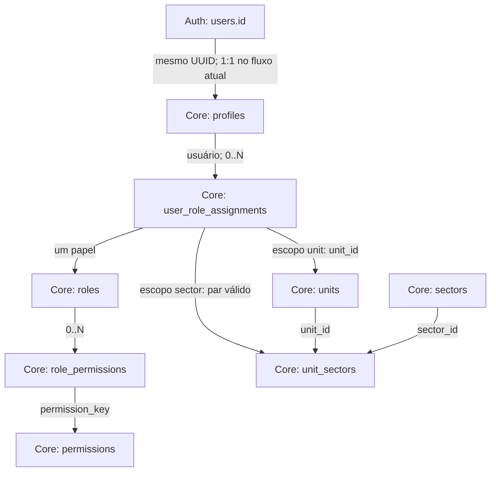

# Fundação Core v2 — contratos canônicos

Status: DESIGN ONLY — consolidação da arquitetura aceita e recomendações para revisão.
Data: 2026-10-08.
Brief: [Core Foundation Contract v2](../briefs/CORE_FOUNDATION_CONTRACT_V2.md).
Base examinada: `d2e30774eb7ab354f13edc7968a5b47f1d2a0891`.
Branch deste documento: `docs/core-foundation-contract-v2`.
Integração prevista pelo brief: `integration/core-foundation-v2`.

## 1. Autoridade e classificação das decisões

Este documento define o significado dos contratos compartilhados, seus limites e o comportamento observado na base. Não implementa APIs, altera consumidores ou aprova regras de produto pendentes.

- **S — Suportada:** decisão já sustentada por ADR aceito ou pela implementação da base. Quando a intenção documental é mais ampla que a implementação, a diferença está explícita.
- **R — Recomendação:** proposta de arquitetura; não é capacidade disponível nem autorização de implementação.
- **PO — Decisão de produto pendente:** depende de aprovação do Product Owner. A recomendação associada não substitui essa aprovação.

Os ADRs aceitos continuam prevalecendo. Recomendações não os substituem. Uma futura mudança de contrato exige brief aprovado e, se alterar uma decisão aceita, atualização formal da decisão. Até lá, consumidores preservam os contratos existentes.

Fontes normativas: [ADR-001](../decisions/ADR-001-modular-monolith.md), [ADR-002](../decisions/ADR-002-core-and-module-ownership.md), [ADR-005](../decisions/ADR-005-core-authorization.md), [Authorization](AUTHORIZATION.md), [Data Model](DATA_MODEL.md), [Product Structure](PRODUCT_STRUCTURE.md) e [Security](SECURITY.md).

## 2. Propriedade das entidades

**S —** A plataforma é um monólito modular. Core possui conceitos corporativos estáveis; cada módulo possui seus registros, regras e workflows. Módulos podem depender de Core/Shared; Core nunca depende de módulos de negócio.

| Conceito | Proprietário e identidade canônica | Responsabilidade / limite |
| --- | --- | --- |
| Identidade autenticada | Supabase Auth; `auth.users.id` | Credenciais, e-mail de acesso e sessão. Core não duplica senhas/tokens. |
| Cadastro do usuário | Core; `core.profiles.id`, igual ao ID Auth | Nome de exibição, situação ativa e metadados do cadastro. Não é um cadastro independente de pessoa. |
| Pessoa sem conta / responsável externo | Não definido no Core atual | Não existe entidade canônica de pessoa independente do Auth; extensão depende de PO-01. |
| Responsabilidade de negócio | Módulo consumidor | Significado de “responsável”, elegibilidade, obrigatoriedade, substituição e histórico da atribuição de trabalho. Uma referência ao usuário Core não concede acesso. |
| Unidade | Core; `core.units.id` | Código, nome e lifecycle organizacional. Não armazena indicadores ou workflows dos módulos. |
| Setor | Core; `core.sectors.id` | Catálogo corporativo compartilhado; não é uma cópia por unidade. |
| Validade setor/unidade | Core; par `core.unit_sectors(unit_id, sector_id)` | Determina em quais unidades o setor existe. Não representa lotação de empregado. |
| Perfil de acesso / papel | Core; `core.roles.id`, com `key` única | Conjunto reutilizável de permissões; distinto do cadastro `profiles`. |
| Permissão | Core; `core.permissions.key` | Catálogo central das capacidades implementadas. O módulo define a semântica de sua capacidade; Core compõe/evalua acesso. |
| Composição de perfil de acesso | Core; par `role_id, permission_key` | Associação de permissões a um papel. |
| Atribuição de acesso | Core; `core.user_role_assignments.id` | Vincula usuário, papel e um escopo. Não atribui tarefas nem comprova vínculo trabalhista. |
| Escopo | Core; forma da atribuição | Global, unidade ou setor dentro de uma unidade. Não é uma lista global de unidades no usuário. |
| Log operacional/de segurança | Core; `core.system_audit_log.id` | Contrato de trilha da plataforma; separado de Auditorias da Qualidade. |
| Capa de unidade | Core/Unit; contrato Unit Cover v1 | Capacidade já existente; não altera identidade nem autorização geral da unidade. |
| Registros e referências históricas de negócio | Respectivo módulo | FKs canônicas e dados históricos justificados pelo domínio; sem duplicar cadastros corporativos. |

“Usuário” neste contrato significa conta Auth associada a cadastro Core. “Perfil de acesso” significa `roles`. “Responsável” significa uma relação de negócio definida pelo consumidor; “atribuição” sem qualificador nesta documentação significa atribuição de acesso.

## 3. Relações canônicas

**S —** Relações abaixo derivam do modelo físico e do ADR-005; não introduzem tabelas.

Global usa ambos os IDs de organização nulos. Escopo de setor exige o par do vínculo; setor isolado não identifica um escopo. Registros dos consumidores referenciam o cadastro do usuário, a unidade e, quando aplicável, o setor/par válido. A tabela de log possui referências opcionais a usuário/unidade/setor; ela não é um catálogo de entidades de negócio.

## 4. Identidade, usuário e responsável

### 4.1 Identidade Auth e cadastro Core

**S —** `auth.users.id` é a identidade autenticada; `core.profiles.id` é PK/FK com o mesmo UUID. A base cria o cadastro por trigger após a criação da identidade Auth. Não há fluxo de criação de conta implementado neste contrato.

O cadastro tem `display_name`, `active`, `version`, `created_at` e `updated_at`. O nome é obrigatório, com 1–160 caracteres após desconsiderar espaços nas extremidades para a validação. E-mail e `last_sign_in_at` pertencem ao Auth; a projeção administrativa os consulta sem copiá-los ao cadastro. Último sign-in não representa última atividade de negócio.

Sessão válida não implica acesso. Ausência de cadastro ativo ou ausência de concessão aplicável nega acesso operacional. O nome recebido inicialmente de metadata Auth é somente apresentação; não participa da autorização.

**S —** Renomear cadastro não muda UUID nem e-mail. A Administração atual permite alteração de nome/situação sob `private.can_manage_profile`, com autoridade sobre as atribuições do alvo, sem autoalteração por esse caminho.

### 4.2 Responsável como referência

**S —** Quando um domínio representa uma pessoa com conta, a referência canônica disponível é o UUID de `core.profiles`. Nome, e-mail, papel e ID de atribuição de acesso não substituem esse identificador. Não há cadastro Core de pessoas sem conta.

**S — Compatibilidade dos consumidores existentes:**

| Consumidor | Contrato observado | Consequência |
| --- | --- | --- |
| Auditoria | `audit.inspections.responsible_id` referencia `core.profiles.id`; criação usa `auth.uid()` | Responsável é o próprio criador no fluxo atual. Não se introduz seleção de outro usuário. |
| Planos de Ação | `action_plans.plans.responsible` é texto; atores de criação, conclusão e verificação referenciam `core.profiles` | Texto de responsável não pode ser tratado como UUID, cadastro duplicado ou concessão de acesso. Conversão exigiria decisão de produto e trabalho próprio. |

**R —** Em capacidades futuras aprovadas que necessitem de responsável com conta, usar referência ao cadastro Core, mantendo no módulo a regra de elegibilidade e a atribuição de trabalho. Não inferir identidade a partir de igualdade de nomes/e-mails e não converter o texto de Planos de Ação nesta fundação.

**PO-01/PO-02 —** Pessoa sem conta, responsável externo, responsabilidade compartilhada e exigência de acesso operacional do indicado não estão definidos. Um usuário ativo não é automaticamente elegível em todos os módulos; papel/escopo de acesso não comprova lotação ou função empresarial.

## 5. Unidade, setor e validade organizacional

**S —** Unidade e setor possuem UUID, código obrigatório e único no respectivo catálogo, nome, `active`, `version` e timestamps. Código admite 1–40 caracteres e nome 1–160 pela validação atual. UUID é o identificador de referências; código é uma chave de negócio separada; nome é apresentação mutável.

O setor é global. O mesmo `sector_id` pode estar vinculado a várias unidades. Um registro setorial deve informar unidade e setor válidos como par, não selecionar qualquer setor do catálogo sem considerar a unidade.

**S —** `unit_sectors` tem PK composta e não possui `active`, período de vigência ou versionamento temporal. Inserção exige unidade e setor ativos. Administração pode remover um vínculo não referenciado; FKs impedem remoção quando atribuições setoriais ou planos o referenciam, inclusive atribuições revogadas. Desativar unidade/setor preserva o vínculo.

**S — Divergência de detalhe:** ADR-005 descreve o código da unidade como estável, mas a implementação permite editar `code` de unidades e setores. A unicidade atual é a do texto armazenado; não há contrato de unicidade sem distinção entre maiúsculas/minúsculas nem normalização corporativa.

**R —** Tratar UUID como permanente e evitar reutilizar código para outra entidade. Correções de código devem preservar o UUID e ser auditadas; não usar nomes/códigos como FK. Estabilidade absoluta, regras de caixa, reaproveitamento e alteração de código dependem de PO-05.

**R —** Preservar vínculos referenciados e avaliar lifecycle explícito do vínculo somente se houver necessidade aprovada de encerrar sua validade sem apagar história. Não acrescentar status, vigência ou hierarquia organizacional por antecipação.

## 6. Perfis de acesso, permissões e atribuições

**S —** Permissão identifica uma capacidade, não um cargo. Papel agrupa permissões. A aplicação verifica a chave de permissão; não decide acesso por nomes de papéis. As chaves existentes, inclusive `action_plan.read` e `action_plan.create_manual`, são contratos; não renomeá-las para adequá-las a um padrão textual.

**S —** Papel tem UUID, `key` única, nome, descrição, `system`, `active` e `global_only`. Papéis de sistema não são editáveis pela administração comum. `platform_administrator` exige atribuição global. Sua composição é seed de capacidades existentes, sem bypass implícito nem inclusão automática de futuras capacidades.

**S —** Atribuição é uma concessão positiva com identidade própria, usuário, papel, forma de escopo, `active`, versão, timestamps e concedente. Cada usuário pode ter múltiplas atribuições; atribuições equivalentes ativas não podem se duplicar.

| Escopo | Forma válida | Cobertura |
| --- | --- | --- |
| Global | `unit_id = null`, `sector_id = null` | Recursos aplicáveis à permissão em qualquer unidade/setor; ainda sujeito à regra de domínio. |
| Unidade U | Unidade obrigatória; setor nulo | Recursos da unidade U, inclusive seus recursos setoriais. |
| Setor U/S | Unidade e setor obrigatórios; vínculo existente | Somente recursos pertencentes a S dentro de U. Não cobre registros da unidade inteira. |

**S —** Concessões são avaliadas por permissão e escopo na mesma atribuição, com união dos resultados aplicáveis. Permissão de um papel não recebe o escopo de outro. Ausência de concessão nega; não há overrides diretos por usuário nem regras negativas de precedência.

Criar atribuição exige usuário/papel ativos, organização ativa quando informada, forma válida, `global_only` respeitado e autoridade de delegação. Delegar exige `admin.user.manage` global e capacidade de conceder as permissões do papel no escopo solicitado. Revogar usa a autoridade própria de revogação, inclusive quando o papel está inativo.

**S —** Clientes revogam atribuições, não editam seu usuário/papel/escopo nem reativam linhas revogadas. Nova concessão cria nova atribuição. Composição de papel usa `core.save_role` transacional e verifica autoridade sobre permissões existentes e propostas; alteração afeta concessões atuais desse papel, sem reescrever suas identidades.

## 7. Lifecycle e estados

**S —** `active` não tem uma única consequência para todas as entidades. Distinguir situação do cadastro, concessão efetiva, elegibilidade para novos vínculos e leitura histórica.

| Entidade / transição | Comportamento suportado na base | Limite / decisão pendente |
| --- | --- | --- |
| Conta Auth criada | Trigger cria cadastro Core ativo; sem atribuição não há acesso de negócio | Provisionamento administrativo e eventual revogação de sessões têm fluxo próprio. |
| Usuário ativo → inativo | Helpers negam acesso; trigger revoga todas as atribuições ativas; IDs e registros históricos permanecem | Não equivale a exclusão Auth ou garantia de encerramento imediato de toda sessão/cache já emitido. |
| Usuário inativo → ativo | Cadastro volta a estar ativo; atribuições revogadas não são restauradas | Acesso exige novas concessões explícitas. |
| Papel ativo → inativo | Permissões desse papel deixam de valer; atribuições permanecem | Outros papéis do usuário continuam aplicáveis. |
| Papel inativo → ativo | Atribuições ainda ativas voltam a produzir acesso conforme sua composição atual | PO-06: confirmar se v2 manterá essa restauração automática. |
| Permissão ativa → inativa | Helpers e `my_access` deixam de retorná-la; composição dos papéis permanece | Não há editor comum de lifecycle de permissões; reativação técnica torna a capacidade efetiva nas concessões ainda válidas. |
| Atribuição ativa → revogada | Somente essa concessão deixa de valer; linha permanece para histórico | Nova concessão não restaura a linha revogada. |
| Unidade/setor ativo → inativo | Novos vínculos organizacionais e atribuições nesse alvo são rejeitados; criação atual de auditoria/plano valida atividade aplicável | Helpers de autorização não testam atividade da unidade/setor. Não há revogação automática das atribuições existentes. |
| Unidade/setor inativo → ativo | Mesmos UUIDs; vínculos/atribuições existentes preservados; alvo volta a aceitar novos vínculos válidos | Não reconstrói concessões revogadas nem cria responsabilidade de negócio. |
| Vínculo unidade/setor removido | Somente possível quando integridade referencial permitir | Não há estado “inativo” de vínculo; vigência histórica depende de PO-07. |
| Renomeação | Referências por UUID preservadas; consultas que fazem join exibem o nome atual | Nome “na época” exige política explícita, PO-08. |
| Exclusão física | Não é lifecycle administrativo normal; FKs sem cascade de histórico e ausência de grants de DELETE nos cadastros protegem o uso comum | Expurgo/anonimização não é autorizado por este contrato. |

**S —** A leitura de história não deve exigir que o alvo referenciado continue ativo, mas exige que o leitor permaneça autorizado. A inativação do próprio leitor nega acesso; a inativação de um responsável histórico não apaga o registro.

**S — Limite de implementação:** AUTHORIZATION descreve inativação como bloqueio de novo uso operacional. Na base, isso está aplicado à criação de auditorias/planos e a novos vínculos/atribuições; não existe bloqueio universal de todas as mutações de registros existentes em unidade/setor inativos. Finalização/reabertura de auditorias e alteração de planos seguem seus contratos atuais e podem continuar quando a autorização/regra do domínio permitir.

**PO-04 —** Bloquear, permitir encerramento ou permitir operação integral de pendências após inativação é decisão de produto por workflow. Não deduzir um novo bloqueio global nem alterar Audit/Action Plans neste documento.

## 8. Consumo pelos módulos e contratos de leitura

### 8.1 Contratos disponíveis

**S —** Uma permissão de negócio não concede acesso irrestrito às tabelas administrativas Core. Consultar essas tabelas pelo cliente está sujeito às respectivas RLS; o conjunto de resultados pode ser parcial.

| Leitura atual | Autorização / projeção | Uso correto |
| --- | --- | --- |
| `core.profiles` | Leitor ativo: próprio cadastro ou concessão global `admin.user.read/manage` | Cadastro próprio/admin; não é diretório operacional geral de responsáveis. |
| `core.user_directory(p_search, p_inactive)` | Leitor ativo com `admin.user.read/manage` global; cadastro + e-mail e último sign-in | Administração. Busca nome/e-mail; inativos só quando solicitados. Não reutilizar como seletor de usuários para todos os módulos. |
| `core.units` | Leitura conforme `units_read`: leitura/gestão administrativa de unidade no escopo, ou hipóteses globais de gestão de usuário/leitura ou gestão de setor | Administração sob RLS; não assumir que Quality pode ler o catálogo por ter permissão de auditoria. |
| `core.sectors`, `core.unit_sectors` | Leitura por permissões globais de leitura/gestão de setor ou gestão de usuário | Catálogo administrativo; não contornar a RLS para popular seletores. |
| `core.my_access()` | Concessões efetivas do próprio leitor ativo | Projeção de permissões/escopos para UX; não é diretório nem prova suficiente para uma mutação. |
| `core.role_detail(p_id)` | SECURITY INVOKER; RLS dos papéis e composição | Consulta de perfil de acesso visível; não expõe todo o catálogo. |
| `audit.units()` | `audit.inspection.read` ou `create` por unidade; ID/código/nome/atividade | Contrato existente do consumidor; inclui inativas para contexto/história. Criação valida atividade novamente. |
| `audit.inspection_summaries(...)` | `audit.inspection.read` na unidade | Nome atual da unidade e responsável de uma auditoria autorizada; não concede leitura geral dos cadastros. |
| `action_plans.creation_scopes()` | `action_plan.create_manual` no alvo; unidades/setores ativos e pares válidos | Alvos elegíveis para criar plano manual, inclusive restrição setorial. |
| `action_plans.plan_summaries(...)` | `action_plan.read` no escopo do plano | Contexto de unidade/setor e nomes de atores históricos; não é diretório de usuários. |
| `core.unit_covers(p_units)` / helper Core | `core.unit_cover.read` ou `admin.unit.manage` por unidade; capa atual pronta | Consumir o contrato [Unit Cover v1](../modules/core/UNIT_COVER_V1.md); sem acesso direto aos assets nem persistência de URL assinada como identidade. |
| `core.profile_references(p_ids)` | SECURITY INVOKER sobre `profiles_read`: próprio cadastro ou `admin.user.read/manage` global; até 100 UUIDs; `id`, `display_name`, `active` | Resolução de UUID conhecido, inclusive inativo para história. Não é diretório nem seletor de responsáveis (PO-02); sem e-mail, Auth, papéis ou permissões. |
| `core.unit_references(p_ids)`, `core.sector_references(p_ids)` | Leitor ativo; alvo coberto por um escopo efetivo do próprio leitor (`my_access`): global, unidade, ou setor/unidade da atribuição setorial; setor também pelos vínculos de uma atribuição de unidade; até 100 UUIDs; `id`, `code`, `name`, `active` | Visibilidade de metadado de referência conhecida, inclusive inativa: não autoriza ler o catálogo administrativo nem ler/operar registros de qualquer módulo, que revalidam permissão, escopo e regra de domínio. Concessão revogada, papel inativo, permissão inativa ou papel sem permissão não cobrem nada. Sem busca/listagem; ausente = inexistente ou não visível, indistinguíveis. Elegibilidade para novo uso é validada pelo consumidor na gravação. |
| `core.unit_sector_references(p_units, p_sectors)` | Pares posicionais (até 100); vínculo existente e coberto pelo escopo efetivo do leitor; `unit_active`, `sector_active` | Validade do par unidade/setor. Vínculo não tem lifecycle próprio (PO-07); atividade é informada, não filtrada. |

**S —** As projeções SECURITY DEFINER existentes podem consultar dados não visíveis pela RLS administrativa, mas aplicam explicitamente a autorização do recurso/capacidade e restringem a saída. Elas não legitimam uma função genérica sem controle de acesso. A leitura administrativa permanece inalterada.

### 8.2 Semântica recomendada para leituras compartilhadas

**R —** Separar três finalidades antes de aprovar qualquer API nova:

| Finalidade | Dados mínimos recomendados | Elegibilidade / autorização |
| --- | --- | --- |
| Seleção de novo alvo organizacional | UUID, código/nome, atividade; setor acompanhado de unidade | Ativo, par válido e permissão específica para a operação no alvo. |
| Seleção de responsável com conta | UUID e nome de exibição; atividade para explicar elegibilidade | Leitor autorizado para a operação; candidato conforme política PO-02/PO-03. Sem e-mail, último sign-in ou papéis por padrão. |
| Resolução de referência histórica | UUID e rótulo autorizado; estado inativo quando pertinente | Permissão de leitura do registro que contém a referência; não exigir atividade do alvo. Sem revelar cadastro completo. |

Os resolvedores de referência por UUID conhecido da seção 8.1 ([Core Reference Resolvers v1](../briefs/CORE_REFERENCE_RESOLVERS_V1.md)) não implementam seleção de novo alvo nem de responsável. Não há diretório operacional implementado. Estes são contratos semânticos recomendados; nomes, assinaturas e regras de visibilidade serão especificados somente no brief aprovado da capacidade necessária.

**R — Regras para qualquer futura leitura aprovada:**

1. Avaliar identidade, cadastro ativo e autorização no servidor/banco. Nunca aceitar “pode acessar” informado pelo cliente nem expor credencial privilegiada.
2. Preferir RLS/SECURITY INVOKER para leituras diretas. Quando uma projeção controlada precisar de SECURITY DEFINER, justificar a necessidade, limitar EXECUTE, fixar `search_path`, qualificar relações e revalidar a capacidade/escopo explicitamente.
3. Escolher a capacidade pelo contrato da operação; não aceitar chave arbitrária que permita a qualquer módulo usar outra permissão para enumerar cadastros.
4. Retornar somente os campos necessários. Diretório de responsável não herda os dados pessoais da Administração.
5. Usar busca limitada e literal, paginação e ordenação estável com UUID como desempate; não varrer toda a empresa no browser. A ausência de resultado não prova inexistência.
6. Na resolução histórica por registro, comprovar acesso ao registro pelo consumidor antes de enriquecer sua referência. Não criar lookup global por UUID nem fazer Core consultar tabelas de negócio.
7. Revalidar atividade, vínculo, elegibilidade e permissão na transação da gravação; o resultado de um seletor pode envelhecer entre seleção e envio.
8. Erros devem distinguir falha de carregamento de lista vazia na UX, sem revelar a existência de IDs não autorizados. Caches não são autoridade e devem respeitar troca de usuário/contexto.

**R — Alternativas:** ampliar leitura de tabelas Core para usuários de negócio é simples, mas mistura diretório/admin e pode expor dados além da finalidade. Criar um resolvedor genérico privilegiado reduz duplicação, mas amplia o risco de enumeração e acoplamento. Recomenda-se manter os contratos atuais e introduzir apenas projeções Core específicas quando a necessidade e a política de visibilidade forem aprovadas. Core fornece cadastro/organização/acesso; o consumidor fornece a regra de negócio, sem dependência reversa.

## 9. Invariantes de autorização

**S —** O acesso depende de identidade autenticada, cadastro ativo, atribuição ativa, papel ativo, permissão ativa, cobertura do escopo e regra de linha/domínio. Falta ou ambiguidade nega.

- Visibilidade de navegação, `can`, `hasAnyScope` e `my_access` são apoio de UX. Banco/servidor decide com o estado vigente.
- Um grant setorial não lê uma auditoria de unidade inteira nem uma capa unitária. Planos de Ação usa a autorização setorial quando o plano possui setor.
- Leitura, criação, escrita, finalização, verificação e exportação continuam capacidades distintas. Acesso de exportação não autoriza dados fora do escopo.
- Escolher usuário como responsável não altera seus papéis, escopos ou permissões, nem dá ao solicitante acesso aos dados desse usuário.
- Escopo selecionado na navegação não concede acesso; “global” não significa autoridade para toda operação.
- Sem atribuições ativas efetivas, não há acesso operacional; dados JWT/metadata ou nome do papel não substituem o banco como fonte das concessões.
- Dados de acesso de outro usuário não são públicos; leitura/gestão administrativa possui controles próprios.
- Alteração de acesso deve respeitar autoridade de delegação/revogação e trilha. Não conceder mais permissões/escopo do que o administrador pode delegar.
- Revogação não pode ser ignorada por uma mutação que aguardou locks: os consumidores existentes revalidam autorização após locks com estado atualizado e serializam as concessões relevantes. Preservar esse comportamento.
- Tabelas expostas exigem grants explícitos e RLS. Helpers privados não são APIs de administração genéricas; segredo de serviço nunca chega ao browser.

**S —** Atividade de unidade/setor não faz parte da equação dos helpers atuais. Trata-se de elegibilidade/lifecycle operacional além da autorização, conforme seção 7. Uma futura mudança global nessa equação seria alteração de contrato, não correção documental silenciosa.

## 10. Referências históricas

**S —** IDs canônicos sobrevivem à inativação. Não apagar, anular, transferir ou trocar referências de registros passados só porque um cadastro foi desativado. Preservar autores de criação/atualização, responsáveis e atores de conclusão/verificação.

**S —** A base usa FKs para integridade e não cascade de exclusão da história por remoção de usuário/unidade/setor. `version` é controle de concorrência das linhas mutáveis; não é uma versão temporal do cadastro. Timestamps/log não equivalem a um mecanismo geral de consulta “como era naquela data”.

**S —** As projeções de resumo examinadas resolvem nomes atuais por join. Uma renomeação pode mudar o rótulo exibido em registros antigos, sem mudar sua identidade. Isso não comprova preservação do nome na época em toda saída/exportação.

**R —** Se um domínio precisar de rótulo imutável no momento de um evento, preservar uma projeção mínima própria do registro/evento, sem transformar esse snapshot em cadastro corporativo concorrente. Seu ponto de captura, campos e retificação devem ser aprovados; não copiar snapshots para todos os módulos preventivamente.

**R —** Em edição, uma referência histórica inativa deve poder ser apresentada como tal sem voltar à lista de novos candidatos. Se o label não puder ser resolvido, preservar a referência e apresentar estado restrito/indisponível segundo a visibilidade do registro, sem buscar por canal privilegiado.

**PO-03/PO-04/PO-08 —** Retirada de elegibilidade de responsável, inativação de organização e renomeação não determinam por si só transferência automática de trabalho, congelamento de pendências ou snapshot obrigatório. Cada consequência precisa de decisão explícita; contratos atuais continuam vigentes.

## 11. Contrato da trilha de sistema

**S —** `core.system_audit_log` é trilha operacional/de segurança, independente do módulo Audit. Core é dono do armazenamento/controle de leitura; o módulo produtor define o evento da sua operação e produz os dados por mecanismo confiável.

| Campo existente | Significado contratual |
| --- | --- |
| `id`, `occurred_at` | Identidade do evento e instante `timestamptz`, atribuído no banco. |
| `actor_user_id` | Referência Core do autor; nulo para execução sem identidade de usuário. Não aceitar autor arbitrário informado pelo browser. |
| `module`, `action` | Proprietário/contexto técnico e ação registrada, com semântica explícita do produtor. |
| `entity_type`, `entity_id` | Tipo e identificador textual da entidade afetada, inclusive chave composta quando aplicável. Não é FK polimórfica nem autoriza consultar a entidade. |
| `unit_id`, `sector_id` | Contexto organizacional opcional para filtragem de acesso. Evento sem unidade requer concessão global; setor pertence ao contexto da operação. |
| `before_data`, `after_data` | Projeções justificadas da alteração; podem ser nulas conforme o evento. Não são autorização nem warehouse de negócio. |
| `metadata`, `correlation_id` | Contexto adicional mínimo e correlação quando disponível; correlação não é identidade de usuário. |

**S —** Clientes autenticados não recebem INSERT/UPDATE/DELETE comuns no log. Leitura usa `admin.audit_log.read` no contexto do evento. Core registra mudanças nos cadastros, composição, atribuições e vínculos; produtores Audit/Action Plans possuem seus próprios mecanismos confiáveis para suas operações. Alterações de capa usam o contrato próprio, excluindo object keys do payload.

**S —** A base oferece proteção contra alteração pelo cliente comum, não imutabilidade absoluta contra o operador privilegiado do banco. Os triggers Core registram before/after das linhas atuais; não há sanitização universal que torne seguro acrescentar qualquer dado sensível às entidades.

**R —** Para novas mutações sensíveis aprovadas, registrar evento na mesma transação da mudança; derivar autor de contexto confiável, usar namespace/ação estáveis, minimizar campos e excluir senhas, tokens, URLs assinadas e conteúdo pessoal desnecessário. Ator nulo deve ter origem técnica explicável em metadata quando houver esse contexto. Correlation ID não deve carregar segredo.

**PO-09 —** Retenção, acesso operacional, expurgo/anonimização e requisitos adicionais de integridade da trilha dependem de política aprovada. Este documento não estabelece prazo legal nem autoriza exclusão física.

## 12. Decisões que precisam do PO

Nenhuma linha abaixo está aprovada por este documento. O baseline indicado descreve a base, não uma solução presumida para módulos ainda não implementados.

| ID | Pergunta a decidir | Baseline / alternativas | Recomendação e consequência |
| --- | --- | --- | --- |
| PO-01 | Responsáveis precisam existir sem conta Auth, ser externos ou ser grupos? | Hoje só há cadastro de usuário com Auth; Planos de Ação mantém texto. | **R:** manter a referência Core de usuário onde o domínio exige conta; não criar cadastro de pessoas/grupos sem necessidade concreta. Se necessário, aprovar propriedade/lifecycle próprios antes de modelar. |
| PO-02 | Quem pode aparecer como candidato a responsável em cada operação? O indicado precisa conseguir operar aquele registro? | Atividade não implica vínculo organizacional; atribuição de acesso não é lotação. Não há seletor Core operacional compartilhado. | **R:** exigir candidato ativo para nova indicação, com elegibilidade explícita do consumidor. PO escolhe entre pessoas visíveis no contexto, diretório corporativo mínimo ou seleção mais restrita e define eventual exigência de acesso do indicado. |
| PO-03 | Ao desativar o responsável ou revogar seu acesso, o que acontece com trabalho pendente? | Referências permanecem; Core revoga acesso do usuário; não existe transferência automática de negócio. | **R:** preservar história e tornar o impacto visível; reassociação explícita conforme o módulo. PO define bloqueio, alerta, substituto obrigatório e quem pode reassociar; Core não executa workflow de negócio. |
| PO-04 | O que pode ser feito em pendências de unidade/setor inativos? | Novas criações/vínculos aplicáveis são bloqueadas; mutações de registros existentes seguem os contratos atuais. | **R:** separar impedir criação de impedir concluir trabalho. PO decide por workflow entre leitura somente, encerramento controlado ou manutenção de operação. Mudança em consumidores exige brief próprio. |
| PO-05 | Código pode ser corrigido, reutilizado ou diferir apenas por caixa? | ADR pede estabilidade; UI/banco permitem edição e unicidade textual atual. | **R:** não reutilizar código para outra identidade; admitir correção auditada com mesmo UUID. PO aprova mutabilidade, normalização e compatibilidade de importações. |
| PO-06 | Reativação de papel deve devolver automaticamente suas concessões ainda ativas? | Hoje sim; reativação de usuário não devolve concessões revogadas. | **R:** manter a diferença explícita e confirmar restauração do papel ou exigir nova aprovação de acessos. Não alterar a base por interpretação. |
| PO-07 | Precisa encerrar um vínculo unidade/setor referenciado, com vigência histórica? | Vínculo não tem lifecycle próprio; referências bloqueiam sua remoção. | **R:** manter vínculos referenciados. Se encerramento for necessário, aprovar semântica de novos usos, história e reativação antes de acrescentar status/vigência. |
| PO-08 | Nomes/códigos em história e relatórios devem refletir cadastro atual ou momento do evento? | Resumos examinados fazem join de nomes atuais. | **R:** manter rótulo atual como padrão existente; snapshot apenas onde produto exigir registro “na época”, com evento e campos definidos. Não redesenhar exportações existentes. |
| PO-09 | Qual política de retenção/anonimização e investigação de cadastros/logs é necessária? | Inativação/preservação é o lifecycle normal; não há política geral de expurgo neste contrato. | **R:** definir finalidade, autoridade, retenção e recuperação antes de qualquer exclusão. Identidades históricas e trilha exigem tratamento conjunto. |

PO-01/02 impedem assumir um modelo novo de pessoa/diretório/responsável. PO-03/04 impedem assumir reassociação ou bloqueio global. PO-05/06/07/08/09 impedem mudar seus comportamentos específicos; não impedem documentar nem preservar o baseline.

## 13. Não objetivos

- Implementar código, migration, RPC, RLS, grants, alteração de esquema ou catálogo.
- Redesenhar Audit, Action Plans, seus responsáveis, integração, estados, evidências ou relatórios.
- Criar conta, resetar senha, construir Minha Conta ou revisão de acessos.
- Criar página detalhada de unidade, dashboard executivo ou novas superfícies administrativas.
- Inventar necessidades de Frota, Custos, Contratos ou outros módulos; sem permissões pré-semeadas.
- Criar pessoa, empregado, equipe, cargo, hierarquia ou lotação sem requisito aprovado.
- Criar um modelo universal polimórfico de tarefas, responsáveis, anexos ou entidades de negócio.
- Introduzir overrides individuais, RBAC em JWT como autoridade ou serviço privilegiado no cliente.
- Substituir Unit Cover v1, alterar storage, retenção de capas ou seus gates operacionais.
- Autorizar deploy, homologação, expurgo, prontidão de produção ou merge.

## 14. Rastreabilidade e revisão documental

Além dos documentos da seção 1, o baseline foi confrontado com:

| Evidência na base | Contratos verificados |
| --- | --- |
| [Core foundation](../../supabase/migrations/202609240001_core_foundation.sql) | Entidades/FKs, escopos, helpers, RLS, criação/inativação de usuário, logs e edição transacional de papel. |
| [Permission catalog](../../supabase/migrations/202609240002_permission_catalog.sql) | Catálogo existente, templates e bootstrap restrito de administrador. |
| [Revocation authority](../../supabase/migrations/202609240003_revocation_authority.sql) | Autoridade de revogação e gestão de cadastro. |
| [User directory](../../supabase/migrations/20261008120000_core_user_directory.sql) | Projeção administrativa Auth/Core, busca e permissão de renomeação. |
| [Types](../../apps/web/src/core/types.ts), [Admin API](../../apps/web/src/core/admin/api.ts), [Users](../../apps/web/src/core/admin/UsersPage.tsx), [Assignments](../../apps/web/src/core/admin/UserAssignments.tsx), [Organization](../../apps/web/src/core/admin/OrganizationPage.tsx), [Sector links](../../apps/web/src/core/admin/SectorUnits.tsx) | Tipos, concorrência por versão, seleção administrativa e mensagens de lifecycle. |
| [Auth provider](../../apps/web/src/core/auth/AuthProvider.tsx), [Permissions](../../apps/web/src/core/auth/permissions.ts), [Client](../../apps/web/src/core/client.ts) | Bootstrap de cadastro/concessões, projeção de UX e cliente sem segredo de serviço. |
| [Audit domain](../../supabase/migrations/202609240004_audit_domain.sql), [Audit authorization](../../supabase/migrations/202609250009_audit_authorization.sql), [Audit API](../../apps/web/src/modules/audit/api.ts) | Apenas consumo de identidade/unidade, responsável atual, projeções e revalidação; sem revisão/redesenho do domínio. |
| [Action Plans domain](../../supabase/migrations/202609240006_action_plans_domain.sql), [Action Plans authorization](../../supabase/migrations/202609250007_action_plans_authorization.sql), [Action Plans API](../../apps/web/src/modules/action-plans/api.ts) | Apenas referências, responsável textual, criação por escopo, contexto histórico e revalidação; sem revisão/redesenho do domínio. |
| [Unit Cover migration](../../supabase/migrations/20261007120000_core_unit_cover_v1.sql), [Unit Cover contract](../modules/core/UNIT_COVER_V1.md) | Capacidade Core existente e limite do seu contrato público. |

A revisão deste entregável é documental: cobertura das perguntas/seções exigidas pelo brief, coerência com as fontes da base, classificação S/R/PO, preservação dos consumidores e diff restrito a este documento. Não foram executados testes de aplicação/banco, typecheck ou build: não há implementação alterada nem afirmação de execução de lifecycle em ambiente vivo. A leitura da base comprova os contratos descritos, não aprovação de produto ou prontidão de produção.
