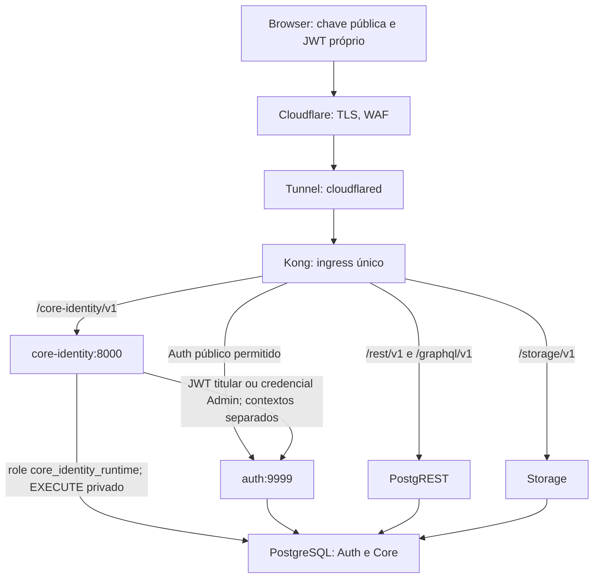

# ADR-007 — Boundary confiável de identidade Core

- Status: **Proposed — opção técnica escolhida; aceite pelo PR de integração**
- Data: 2026-10-08
- Branch: `docs/adr-core-identity-boundary-v1`
- Destino: `integration/core-foundation-v2-wave2`
- Snapshot inspecionado: `113e87ee9838d627228a84a2d45ff069d1da05d4`

## 1. Contexto e autoridade

O [brief](../briefs/CORE_IDENTITY_BOUNDARY_ADR_V1.md) exige um caminho confiável para criar contas, emitir credenciais temporárias, redefinir credenciais, concluir primeiro acesso, trocar a própria senha e revogar acesso de sessões. O browser nunca recebe service role; alterações Auth usam a API suportada, sem DML em `auth.users` como substituto da Admin API.

Esta decisão fecha **runtime, rede e contratos técnicos**. Não implementa serviço, migrations, UI, secrets, SMTP ou deploy. [ACCOUNT_LIFECYCLE_V1](../architecture/ACCOUNT_LIFECYCLE_V1.md) continua uma proposta de produto: seus itens PO não se tornam aprovados implicitamente. O [brief de implementação](../briefs/CORE_IDENTITY_BOUNDARY_IMPLEMENTATION_V1.md) distingue infraestrutura executável de funcionalidades dependentes dessas decisões.

Fontes normativas: [ADR-004](ADR-004-platform-stack.md), [ADR-005](ADR-005-core-authorization.md), [SECURITY](../architecture/SECURITY.md) e [AUTHORIZATION](../architecture/AUTHORIZATION.md). Supabase Auth autentica; Core autoriza por perfil ativo, permissão, atribuição/escopo e regra do recurso. Um serviço com segredo administrativo não amplia a autoridade do ator.

### Evidência do repositório

| Estado observado | Implicação |
| --- | --- |
| Compose mínimo: `db`, `auth`, `rest`, `storage`, `kong`; não há Functions, Studio nem Tunnel provisionado | Adicionar um runtime é mudança explícita de topologia. Diagramas de produção abaixo são destino, não infraestrutura existente. |
| Auth `v2.196.0`; PostgreSQL `17.6.1.136`; Kong `3.9.3`; JWT 3600 s | Validar comportamento na imagem pinada; upgrades não pertencem a este PR. |
| Gateway somente `127.0.0.1:GATEWAY_PORT`; Admin API passa hoje pela rota ampla `/auth/v1/` | A chave protege Auth Admin, mas essa rota não implementa o boundary de ingress proposto. |
| Cadastro público desabilitado, autoconfirm global desabilitado, sem SMTP versionado | Preservar esses controles; modo inicial é recuperação assistida. |
| Trigger `private.create_profile` cria `core.profiles` após insert Auth na mesma transação | Não inserir um segundo profile pelo serviço. Complementar com estado privado de lifecycle no mesmo evento. |
| `private.is_active_user()` verifica hoje apenas `profiles.active` | Primeiro acesso obrigatório e revogação imediata exigem evolução desse helper compartilhado, não somente redirects. |
| `private.can_manage_profile`/`can_revoke` limitam autoalteração e autoridade sobre acessos do alvo | Reusar a mesma semântica em operações privilegiadas. |
| `package-lock.json` resolve Supabase JS/Auth JS **2.117.1** apesar do range `^2.89.0` | Não é necessário atualizar o SDK web apenas para obter `current_password`. |
| CI de infraestrutura fixa exatamente cinco serviços e usa Auth Admin público para fixtures | A implementação terá de atualizar explicitamente essas duas premissas. |

## 2. Decisão

Adicionar **um serviço `core-identity`**, em `apps/core-identity`, no mesmo repositório e Docker Compose. Ele pertence ao Core do monólito modular; é um processo isolado para operações de identidade, não um backend de negócios separado.

Responsabilidades exclusivas: validar identidade/sessão, consultar autoridade Core atual, orquestrar lifecycle com Auth, persistir operação/auditoria e expor contratos estreitos. Não recebe operações SQL, URLs de upstream, payloads Auth arbitrários nem grants escolhidos pelo cliente. Não oferece proxy genérico de Admin API, diretório corporativo, administração de MFA, rotinas de Qualidade ou distribuição de arquivos.

### Runtime e política de dependências

- **Node.js 24 LTS**, TypeScript strict, ESM, **Fastify 5** e `pg` 8. Usar schemas JSON nativos de Fastify e logging estruturado com sua infraestrutura Pino; não introduzir ORM, NestJS, Redis, broker ou framework SSR.
- Adaptador HTTP pequeno com `fetch` nativo para os endpoints GoTrue pinados. Acessar `http://auth:9999`, cuja raiz é `/admin/users`, `/user`, etc.; não montar um Supabase JS client padrão nessa URL presumindo que exista `/auth/v1`.
- Novas dependências têm versão exata no manifest e lockfile. Pin de patch e digest da imagem Node é definido e registrado no primeiro PR de implementação, após verificação de suporte e vulnerabilidades. Nenhum `latest`, import remoto ou download de dependência no boot.
- Imagem em múltiplos estágios, usuário não root, filesystem read-only, `tmpfs` limitado, capabilities removidas, `no-new-privileges`, limites de recursos e pool DB pequeno. Sem socket Docker, credenciais de host ou ferramentas administrativas no container final.
- Revisão trimestral de suporte/atualizações pelo mantenedor; migrar de LTS antes de EOL, com o mesmo conjunto de testes. Node 24 tem suporte previsto até abril de 2028; manter por anos significa atualizar deliberadamente, não congelar o runtime para sempre.

### Delta explícito do ADR-004

Ao ser aceito, este ADR **estende** ADR-004 com o processo `core-identity` atrás de Kong e com mediação das alterações de credenciais. Mantém React/Vite, Supabase Auth, PostgreSQL/PostgREST/Storage, Docker Compose, Cloudflare Tunnel e host único. Não adiciona Edge Functions, gateway alternativo, Kubernetes, banco de identidade paralelo ou backend geral. ADR-004 não é reescrito neste PR; seu requisito de topologia oficial ganha esta exceção limitada e documentada.

## 3. Alternativas e trade-offs

| Critério | Serviço Core escolhido | Supabase Edge Functions self-hosted | Administração técnica manual + Auth público do titular |
| --- | --- | --- | --- |
| Segurança | API restrita, credencial só no servidor, DB role estreita; possui segredo Auth amplo e exige revisão | Mesmo segredo e controles de aplicação; `verify_jwt` sozinho não autoriza nem impede JWT revogado | Admin API por ferramenta de operador é suportada sem segredo no app; não fornece delegação/auditoria integrada de produto |
| Operação por anos/equipe pequena | Um processo Node/TS no ecossistema já usado, upgrade LTS regular | Adiciona Deno/edge-runtime, dispatcher, workers e ciclo de upgrade distinto | Pouco runtime novo; dependência permanente de operadores e procedimentos manuais |
| Simplicidade | Um serviço, sem fila externa; operações duráveis no PostgreSQL existente | Um serviço também, mas precisa restaurar runtime/volumes/rotas omitidos e configurar limites de workers | Mais simples para bootstrap ocasional; insuficiente para lifecycle na aplicação |
| Observabilidade/health | Processo e readiness explícitos, métricas e logs homogêneos | Possível; precisa observar dispatcher e função, além das dependências | Logs nativos Auth não atribuem, sozinhos, administrador de produto e motivo |
| CI | Imagem imutável, testes HTTP/DB e Compose idêntico ao alvo | Viável; incluir runtime pinado e testar o handler real, não apenas CLI cloud | Não exercita fluxo administrativo de produto/reconciliação |
| Backup/restore | Serviço sem volume de dados; ledger/estado/auditoria no mesmo DB Auth/Core | Mesmo DB, mais código/configuração de dispatcher/functions para reproduzir | Restore Auth/Core funciona; decisões/etapas manuais ficam menos rastreáveis |
| Secrets/rotação | Injeção server-only; coordenação do legado HS256 | Mesma necessidade; cuidado com propagação de env aos workers | Segredo nos instrumentos do operador; maior dispersão humana |
| Falhas parciais | Saga curta com hold, ledger e reconciliação | Necessita a mesma saga; função não cria transação distribuída | Sem ledger, operador precisa reconstruir resultados manualmente |
| Tunnel/Kong | Nova rota interna; nenhuma porta pública adicional | Rota `/functions/v1` e dispatcher precisariam ser adicionados | Mantém Auth; não resolve mediação/auditoria de primeiro acesso/troca própria |
| Extensão futura | Apenas lifecycle Core sob novo brief | Útil quando houver necessidade real de outras Functions | Não é fundamento de autosserviço na aplicação |

**Rejeitar Edge Functions para v1**, não por falta de suporte: Functions self-hosted existe oficialmente. Não oferece HA ou distribuição global nessa máquina única; também não elimina autorização, secrets, saga ou observabilidade. Hoje acrescenta um ecossistema sem necessidade concreta. Reavaliar se surgir workload de Functions aprovado ou se a equipe passar a operá-lo de forma padronizada.

**Rejeitar o caminho manual como runtime de produto.** Chamar Admin API com ferramenta administrativa server-side é a alternativa suportada mais estreita para bootstrap/emergência; trocas próprias e recovery SMTP também têm APIs nativas. Essa composição não implementa primeiro acesso imposto no banco, atribuição do ator humano, operação idempotente e suporte de criação/reset dentro da Administração. Conservar ferramenta manual somente em procedimento de emergência separado e auditado, não como caminho cotidiano.

Worker Cloudflare confiável seria tecnicamente possível, mas levaria o segredo Auth para outra plataforma e exigiria conectividade/autenticação servidor-servidor e observabilidade distribuída. Rejeitado para a equipe/host atuais. SQL privilegiado escrevendo tabelas Auth e service role no browser são proibidos, não alternativas válidas.

## 4. Rede e ingress

Destino produção: `cloudflared` no mesmo host acessa o listener Kong loopback. Se depois for containerizado, usa uma rede de ingress dedicada com Kong, sem acesso a DB/Auth/Core; não expor portas para acomodá-lo. Tráfego HTTP em loopback/rede Docker fica restrito ao mesmo host confiável; saída desse boundary exige TLS. Não há acesso direto público a `core-identity`, `auth`, `db`, REST interno, Storage interno ou Kong Admin.

Separar redes Compose internas: `identity-ingress` (Kong/Core), `identity-auth` (Core/Auth) e `identity-db` (Core/DB), além das ligações Supabase necessárias. Core não participa da rede REST/Storage nem tem egress irrestrito. As redes reduzem exposição; Auth e DB, multihomed, ainda pertencem ao boundary confiável do host. Não anunciar isolamento contra root/Docker administrador.

### Matriz de rotas externas

| Caminho/método | Destino/regra |
| --- | --- |
| `/core-identity/v1/*` contratos abaixo | Kong → Core; preservar JWT exatamente, sem fallback para chave pública ou service role; CORS por allowlist exata |
| `POST /auth/v1/token`, grants `password`/`refresh_token` | Auth nativo; signup continua desligado; demais grants ficam negados enquanto não aprovados |
| `GET /auth/v1/user`, `POST /auth/v1/logout` | Auth nativo, para cliente existente e logout; não concedem acesso operacional Core |
| `GET /auth/v1/health`, `/settings`, `/.well-known/jwks.json` | Somente resposta mínima nativa exigida por cliente/probes, sem configuração sensível |
| `PUT /auth/v1/user` | **Negado externamente**; troca de credenciais passa pelo Core, inclusive chamadas diretas do SDK |
| `/auth/v1/admin/*`, `/signup`, `/invite`, `/generate_link`, `/recover`, `/verify`, OAuth/SSO/MFA não habilitados | Default deny externo em v1 sem SMTP; Auth Admin usa rede interna direta. Recuperação/convite/MFA precisam de extensão explícita testada |
| REST, GraphQL e Storage existentes | Mantidos com autorização Core reforçada; schema `private` nunca é exposto |
| `/livez`, `/readyz`, `/metrics` do Core | Somente interno; nenhuma rota pública de diagnóstico |

Substituir a rota Auth genérica por allowlist de **método e caminho normalizados**, com negação de tudo que não é declarado; não depender só da prioridade de uma rota prefixada. Testar escapes, barras, trailing slash, caminhos parecidos, métodos e headers duplicados no Kong real. Não bloquear uma alteração de senha apenas procurando o campo `password` num corpo que o proxy não validou. Os paths atuais de callbacks/SSO não são funções de produto habilitadas; removê-los da exposição não habilita novos métodos de login.

Kong oferece transporte/limites grosseiros, não substitui validação do serviço. Cloudflare WAF/Tunnel não concede `admin.user.manage`. Remover headers de identidade técnica enviados pelo público; confiar em IP encaminhado somente por hops declarados. CORS allowlist não é mecanismo de autenticação. O endpoint exige Bearer, não cookie; se cookies forem adotados depois, acrescentar contrato CSRF em novo brief.

## 5. JWT, sessão e autoridade

Para cada request autenticado, sem cache positivo de autorização:

1. Aceitar um único `Authorization: Bearer <JWT de usuário>`; limites de tamanho; negar chave `anon`, `service_role`, token anônimo, duplicações e identidade em body/header alternativo.
2. Enviar o mesmo token a `GET http://auth:9999/user`. Auth pinado verifica a assinatura e o usuário. Negar erro Auth; indisponibilidade é `503`, não aceitação offline.
3. Somente após validação Auth, interpretar os claims e exigir `sub` UUID igual ao ID retornado, `iss` exatamente igual a `GOTRUE_JWT_ISSUER`/`API_EXTERNAL_URL` configurado, `aud=authenticated`, `role=authenticated`, `exp` futuro, `nbf` quando presente e `session_id` UUID. `iat` não prova login recente. `user_metadata`, eventos frontend e nome de role não autorizam.
4. Função privada consulta **somente** ID, titular e `created_at` da sessão Auth, existência atual, profile/lifecycle e marco de revogação. `session_id` deve pertencer ao `sub`, existir e ter criação estritamente posterior ao cutoff vigente. Não usar o `iat` renovado para admitir sessão antiga. Não expor `auth.sessions`, tokens ou usuários Auth ao client/role runtime.
5. Exigir credencial `ready` para operação ordinária; exceção estreita: endpoints `me/status`/primeiro acesso permitem titular ativo `credential_pending`, dentro do prazo/geração, sem permissões/dados de negócio. Estado ausente ou inconsistente nega.
6. Administração: `admin.user.manage` global atual, ator ativo/ready, autoridade equivalente a `can_manage_profile`/`can_revoke` sobre acessos ativos do alvo, e proibição de auto-reset. Criação não atribui roles. Login recente é `auth.sessions.created_at` de sessão autenticada por senha até 300 s (valor inicial CI); refresh não renova essa prova. MFA/AAL2 segue decisão PO-13 antes de produção, sem confiar só em claim antiga.

As consultas de autoridade usam helpers privados com ator explícito derivados dos predicados canônicos; wrappers atuais continuam usando `auth.uid()` validado por PostgREST. Não duplicar RBAC em TypeScript, não definir claims arbitrárias para simular um usuário, nem passar `actor_id` do browser para SQL. O role de conexão do Core autentica o executor técnico; o serviço fornece o ator apenas depois da validação acima.

Revalidar autoridade em cada fase com efeito externo e no commit Core final. Transações usam locks/ordem determinística sobre ator, alvo, assignments e composição de roles relevantes; operações que mudam autoridade têm de respeitar os mesmos locks durante suas transações. Não manter transação SQL aberta enquanto aguarda HTTP Auth. Uma revogação que ocorrer depois de uma fase externamente autorizada não desfaz essa chamada; exige hold/registro do resultado, sem liberar credenciais ou iniciar novas fases. Não prometer atomicidade distribuída.

**Continuação da operação do titular:** o hold aplicado pela própria operação permite somente suas fases internas vinculadas ao ator/sessão/generation registrados, não nova requisição operacional. Após logout intencional confirmado, a finalização própria não exige que a sessão encerrada ainda exista ou que o estado já seja `ready`: usa a autorização inicial durável e a evidência Auth da mesma operação, revalida profile ativo, geração e ausência de hold concorrente/inativação, então conclui. Sem evidência conclusiva de troca/logout, mantém hold. Essa exceção é função privada exclusiva do executor, não argumento `skip_session` público; não permite novos efeitos Auth ou entrega administrativa sem autoridade atual. Administração continua revalidando a sessão/grants do administrador, que não é a sessão encerrada do alvo.

### Boundary de dados e sessões

Evoluir `private.is_active_user()` para incluir lifecycle `ready` e sessão admitida, preservando as demais regras ADR-005. O helper comum protege Data API/GraphQL, RPCs Core e policies Storage que o consomem; inventariar e testar helpers que consultam apenas profile diretamente para fechar qualquer bypass. Não editar domínios de Qualidade para incorporar lifecycle.

Usar função `SECURITY DEFINER` mínima, `search_path=''`, relações qualificadas, leitura limitada de `auth.sessions`, sem `EXECUTE PUBLIC` e sem retorno de dados Auth. Nenhuma escrita em tabelas Auth por SQL. Sessão inexistente após logout nega JWT mesmo antes de `exp`. Check de existência não implementa, sozinho, duração/inatividade; não prometer essas políticas sem homologar Auth self-hosted.

**Limite de revogação:** respostas em andamento/dados baixados não são recolhidos. URLs Storage previamente assinadas continuam com TTL existente; este ADR não transforma downloads assinados em sessões online. Uma garantia mais forte exige novo contrato e aprovação PO-06, preservando Unit Cover/anexos atuais.

## 6. Contratos de operação e Auth API

Todas as mutações exigem `Idempotency-Key` UUID e JSON estrito; resposta contém `operation_id`, `status` e código sanitizado. Nada executa alterações em GET. Operações desconhecidas recebem `404`; `401` identidade inválida, `403` autoridade/estado negado, `409` conflito/geração, `429` limite, `503` dependência/resultado pendente. Uma operação incerta retorna `202` com referência para status, sem declarar sucesso nem retentar cegamente.

| Endpoint Core proposto | Autoridade e efeito |
| --- | --- |
| `POST /admin/users` | Nome/e-mail e justificativa; somente administrador global. UUID v4 reservado pelo servidor no ledger; Auth `POST /admin/users` com esse `id`, senha aleatória e marker `app_metadata` privado de operação. Trigger cria profile e lifecycle `provisioning` na transação Auth. Após conferência e auditoria, passa a `credential_pending`; sem grants implícitos |
| `POST /admin/users/:id/reset` | Autoridade sobre alvo ativo, sem auto-reset. Hold primeiro; Auth `PUT /admin/users/:id` define segredo temporário aleatório e marker da geração na mesma atualização; confirma revogação nativa esperada; registra pendência/auditoria antes de entregar |
| `GET /me/status` | Titular validado; só enum de prontidão, geração e prazo necessário ao onboarding; sem grants/nome de terceiros/dados operacionais |
| `POST /me/first-access` | Titular ativo, geração/prazo válidos; senha atual e nova; Auth `PUT /user` com JWT do titular e `current_password`. Confirma Auth, encerra sessão atual por `POST /logout?scope=global`, avança cutoff e conclui ready; exige login novo |
| `POST /me/password` | Titular ativo/ready; não recebe alvo. Mesmo caminho Auth do titular, hold e prova nativa de senha atual; não usa Admin API para dispensar prova. Encerramento global e novo login após sucesso |
| `POST /admin/users/:id/sessions/revoke` | Autoridade sobre alvo, justificativa; avança cutoff Core e audita, negando imediatamente sessões anteriores em todos os boundaries online Core. **Não troca senha** e não afirma destruir refresh tokens Auth |
| `GET /operations/:id` | Somente ator autorizado da operação ou administrador com autoridade atual sobre alvo; retornar estado sanitizado, nunca segredo. Operação alheia não é enumerável |

O Auth `v2.196.0` aceita ID em create administrativo; esse ID é gerado pelo servidor, não informado pelo browser. Confrontar marker, UUID, e-mail e profile para reconciliar. `app_metadata` de correlação não contém senha e não concede autoridade; só o servidor define esse campo. Esse marker é de escrita confiável, não confidencial: pode aparecer no objeto/JWT do titular. Nunca adotar por e-mail uma conta existente.

Temporária é gerada com CSPRNG do Node, pelo menos 128 bits de entropia e tamanho compatível com Auth. É entregue **uma vez**, depois de resultado durável, em `Cache-Control: no-store`; sem logs, analytics, persistência browser ou cópia no ledger. Expiração e obrigatoriedade são controles Core: Auth não possui senha temporária de uso único com esse contrato. Nova senha passa pela validação Auth; configuração `GOTRUE_SECURITY_UPDATE_PASSWORD_REQUIRE_CURRENT_PASSWORD=true` reforça a prova no servidor nativo. Recovery futuro exige contexto recovery provado, não evento do browser.

`email_confirm=true` é atributo escolhido pelo servidor apenas após política aprovada de verificação do endereço (PO-04); nunca autoconfirm global ou flag livre no request. Sem essa aprovação, criação funcional fica desabilitada fora da fixture CI. Valores recomendados, não decisões de produto aprovadas: prazo 24 h (PO-05), mínimo 12 caracteres (PO-07), justificativa administrativa (PO-08), logout global/novo login e JWT 15 min (PO-06).

### Revogação nativa: garantia e limitação

Na fonte pinada, reset administrativo chama `UpdatePassword(tx, nil)` e termina todas as sessões/refresh e tokens de uso único; troca do titular preserva a sessão que efetuou a atualização, exigindo logout explícito. Esses efeitos precisam de teste com a imagem real antes da entrega funcional. JWT já emitido conserva validade criptográfica até `exp`; o banco/Core o nega pela sessão/cutoff.

`auth.admin.signOut` recebe **JWT de usuário**, não UUID. Não guardar tokens de terceiros nem inventar `signOut(user_id)`. Para revogação administrativa sem troca de credencial, o resultado informa `core_sessions_revoked=true`, `auth_refresh_tokens_revoked=false`: refresh antigo pode alcançar Auth, mas não contorna o cutoff baseado na criação original. Novo login por senha pode iniciar sessão nova; bloquear novos logins exige inativação/reset explícito, outro poder. Para incidente que exige invalidar credencial e revogar nativamente, usar reset autorizado; não aplicar senha aleatória silenciosamente num botão de logout.

## 7. Persistência, idempotência e falhas parciais

DB login `core_identity_runtime`: `LOGIN`, `NOSUPERUSER`, `NOBYPASSRLS`, `NOCREATEDB`, `NOCREATEROLE`, sem membership em `authenticated`/`service_role` e sem DDL/DML direto. Recebe somente `CONNECT`, `USAGE private` e `EXECUTE` em funções específicas de lifecycle, autoridade, rate limit e auditoria. O role não lê tabelas Auth ou ledger diretamente. Owners definers são roles confiáveis de migration; parâmetros SQL são bindados. Service role é utilizado **somente no adaptador Auth Admin**, não para mutações Core/PostgREST.

Estruturas privadas propostas: `identity_accounts` (UUID, prontidão, geração, prazo, cutoff), `identity_operations` (operação, ator, alvo reservado, tipo, fingerprint não secreto, etapas, lease e resultado), `identity_rate_limits` (buckets mínimos). Estado pertence ao mesmo PostgreSQL que Auth/profile/auditoria; sem SQLite/volume/queue externa.

O trigger Auth/profile existente ganha somente a criação de lifecycle `provisioning` e correlação confiável, na mesma transação de create. Estado faltante não é ready por default. Adoção de usuários existentes exige lista explícita/reconciliação auditada, com bootstrap do administrador inicial separado; nunca inferir aprovação para todos por `active=true`. Não desativar profile para representar reset/hold, pois isso revoga assignments pelo trigger atual.

Idempotência é única por ator, operação e chave, com alvo/generation/fingerprint de **campos não secretos**. Chave repetida não repete efeito; campos não secretos divergentes são `409`. Não persistir senha nem hash/HMAC de senha para comparar requests; nova senha enviada com chave já consumida não altera a operação e deve receber status, exigindo chave nova para nova intenção. Reautorizar leitura/retry; perder permissão não concede replay do resultado. Resultado concluído nunca reexibe temporária.

Serializar por alvo (por e-mail normalizado antes de existir UUID), com uma operação mutante durável por identidade e compare-and-swap de geração. Locks DB protegem a fase curta; lease controla o executor entre fases. **Generation/CAS não consegue cancelar uma requisição Auth já em voo.** Timeout/crash antes de prova conclusiva exige hold e reconciliação; lease vencida não autoriza segunda chamada de senha concorrente. Parar/drenar executor anterior antes de retomar uma operação ambígua. Não usar retry automático de create/reset/password em erro de transporte; GET de reconciliação é limitado e repetível.

| Situação | Conduta |
| --- | --- |
| Falha do trigger ou create rejeitado conclusivamente | Auth/profile/lifecycle da criação fazem rollback juntos; auditar falha; não entregar credencial |
| Timeout de create | Consultar Admin GET pelo UUID previamente reservado; conferir marker/e-mail/profile. Ausência após chamada ainda em voo não prova rollback; manter pendente até quiescência |
| E-mail já existente com outro ID/marker | Conflito; não apropriar conta, não conceder grants, não criar profile manualmente |
| Auth confirmado, conclusão Core/auditoria falha | Manter `provisioning`/hold; não entregar segredo; retomar etapa Core pela evidência registrada |
| Reset confirmado, resposta perdida | Marker da geração permite reconciliar efeito administrativo; temporária não é recuperável. Nova reemissão autorizada invalida a anterior |
| Troca própria foi aceita, resposta é incerta | Não testar repetidamente a senha antiga nem liberar por declaração do client. Preservar hold; sem prova durável conclusiva, encaminhar a reset administrativo autorizado |
| Logout falha depois da troca | Hold/cutoff continua negando sessão; repetir apenas etapa logout idempotente após checar resultado atual. Não liberar ready por resposta parcial |
| Ator perde autoridade/alvo é inativado durante a operação | Inativação prevalece; não entregar credencial/liberar ready. Registrar efeito Auth já ocorrido e reconciliar sem rollback de senha |
| Crash após envio de resposta | Ledger concluído serve status, sem replay de segredo; reemissão explícita se entrega for desconhecida |

Cada fase externa tem intenção auditada antes e resultado auditado depois. Estado Core e seu evento ficam na mesma transação. Outage de auditoria impede novo efeito/emissão; outage depois de efeito deixa hold e alerta. Compensação é bloqueio/reconciliação, nunca apagar identidade referenciada, restaurar senha antiga ou desativar RLS. SQL não escreve nem remove `auth.users`, `auth.sessions` ou refresh tokens.

Reconciliação roda no mesmo processo, sem worker/broker adicional, varre somente operações pendentes próprias com backoff limitado e não executa novo efeito privilegiado sem autoridade humana atual. Pode registrar evidência/bloquear com executor técnico e ator original distintos. Estado que exige novo segredo pede reemissão humana; não há fila de senhas/links persistidos.

## 8. Auditoria e observabilidade

`core.system_audit_log` continua a trilha de sistema; domínio Audit/Qualidade não participa. Eventos de intenção, resultado, emissão/reemissão, primeiro acesso, troca própria, reset, revogação Core, falha parcial e reconciliação têm ator UUID **validado**, executor `core-identity`, alvo, instante UTC, motivo administrativo, operação/correlation, geração, status e código sanitizado.

Usar `metadata`/`correlation_id` existentes para contexto e snapshots de nomes mínimos autorizados, compatíveis com ACCESS_GOVERNANCE_V1; não criar uma segunda trilha ou alterar contratos de leitura de outra track. Trigger Auth não identifica sozinho o administrador humano: o evento de operação fornece essa autoria. Browser/runtime não recebem UPDATE/DELETE na trilha; a função privada de evento não aceita payload JSON arbitrário. Eventos externos são intenção/resultado, não falsa transação única.

Logs JSON em stdout com rota **template**, método, latência, request/operation ID, etapa e código. Pino/Fastify não logam Authorization, cookies, apikey, corpo, query de credenciais, resposta temporária, senhas, hashes, tokens ou env. Erros Auth/DB são mapeados, sem dump de upstream/stack para usuário. Log nativo Auth/Kong também precisa de inspeção e teste canário; redigir só o serviço é insuficiente. Names/e-mails/IP são dados pessoais: retenção/acesso depende PO-11; não presumir prazo legal.

Métricas internas sem labels de UUID/e-mail/IP: requests/status/latência por rota, Auth latency/error, DB pool, count/idade máxima de operações pendentes/hold, rate-limit denials e readiness. Alarmar operação pendente > 5 min, falhas Admin Auth sustentadas e container não ready; esses são valores iniciais de CI/staging, calibrados pelo operador. Rotação de logs limita disco; responsável nomeado e retenção precisam de runbook operacional antes de produção.

## 9. Rate limiting e disponibilidade

Limites de aplicação em buckets atômicos PostgreSQL, compartilhados por restart/réplica futura; não introduzir Redis por antecipação. Limitar antes do efeito Auth; se o limitador persistente falhar, negar mutação. Retry de status/reconciliação não consome emissão nova. Expiração/cleanup de buckets não apaga auditoria.

Defaults **somente CI/staging**, sujeitos PO-12 para produto: 10 criações/resets por ator/10 min, 3 resets por alvo/h, 5 provas de senha falhas por identidade/origem/15 min e limite adicional por origem. `me/status`/status de operação: 60/min por sessão. Header `Retry-After`, `429` sem detalhes de terceiros; nunca inativar conta por solicitação anônima. Limite grosseiro Kong por origem protege parsing e chamadas inválidas antes do DB; habilitar plugin rate-limiting compatível com Kong pinado e não depender de recurso WAF pago. NAT corporativo precisa de calibração; não usar IP como único limite.

Auth nativo conserva limites de login/refresh; configurar e testar os parâmetros reais da versão, inclusive origem atrás de Kong. Aceitar IP externo somente via Tunnel/Kong configurados para remover valores fornecidos pelo client; no acesso loopback de CI usar origem local. Body máximo 16 KiB, tamanho JWT/header limitado, JSON strict, upstream timeout 10 s, request deadline 20 s e concorrência/pool limitados. Timeout não autoriza replay de mutação. Esses limites operacionais não definem política de senha.

`/livez`: 200 se processo/event loop responde; não depende de Auth/DB. `/readyz`: 200 somente com configuração/secrets válidos, DB/role/grants/schema na versão esperada, Auth health e validação não mutante da credencial Admin (GET limitado), acesso aos predicados necessários e writes não suspensos; 503 caso contrário. Não criar/resetar usuário para probe. Core readiness espera migrations, sem fazer Kong/Auth depender de Core e gerar ciclo de bootstrap. Compose healthcheck usa readiness; liveness separada evita reiniciar em loop durante outage DB.

`SIGTERM`: retirar readiness, parar aceitar novas mutações, drenar até 30 s, persistir estado possível e fechar pool. Operação interrompida fica reconciliável. Deploy controlado aceita downtime; rollback não depende de HA/blue-green.

## 10. Secrets e rotação

| Material | Onde existe/como usar |
| --- | --- |
| `SERVICE_ROLE_KEY` legado | Já existe em Kong/Storage; nova cópia exclusivamente no secret do adaptador Auth do Core. Privilégio nativo amplo, não fingir chave restrita a reset. Não enviar para SQL/REST/browser |
| Credencial DB `core_identity_runtime` | Secret exclusivo do Core; host `db`, sem senha `postgres`/`supabase_admin` ou role Auth; grants mínimos |
| `JWT_SECRET` | Permanece onde Auth/REST/DB/Storage exigem na stack atual; **não adicionar ao Core**, que valida JWT pelo Auth |
| `ANON_KEY`/URL/issuer/origins | Configuração pública/não secreta; não provam administração; separar URL pública de hostname Docker |
| Tunnel/SMTP/backup | Secrets dos respectivos operadores; Core v1 sem SMTP/Tunnel token. SMTP somente em futuro escopo aprovado |
| Senhas atuais/novas/temporárias | Memória de request apenas; nunca Docker env, arquivo, ledger, trace ou backup Core |

Preferir arquivos montados read-only via Compose secrets em `/run/secrets`, originados fora do checkout, permissions de host restritas. Compose secrets não é cofre nem criptografa arquivo no host: backups de secrets precisam de proteção e acesso separados. Env fica para configurações não secretas/compatibilidade dos serviços Supabase existentes. Separar CI/staging/produção; falhar startup com segredo ausente, placeholder, expirado ou role incorreta. Não imprimir `compose config`, env ou Docker inspect completo em CI.

Rotação DB: suspender writes, alterar senha por procedimento operador, atualizar secret, recriar Core, comprovar old/new access e readiness, remover cópia antiga. Role/grants não mudam. Rotação de legacy service-role não é revogação independente: token HS256 é validado pelo mesmo `JWT_SECRET`, sem catálogo nativo de chaves individuais. Renovar token com o mesmo signing secret **não invalida** token antigo.

Para compromisso HS256: maintenance, backup/config segura, novo JWT secret + novas anon/service keys, atualizar **todos** os validadores/consumidores (Auth, REST, Storage, DB settings, Kong, Core Admin key e configuração web), cortar sessões antigas, testar login/negativas/readiness e reabrir. Não prometer sobreposição JWKS/opaque keys numa stack que ainda não a implementa. Migração para chaves assimétricas/API keys novas exige upgrade/ADR específico. Nunca rollback para signing secret comprometido.

O gerador descartável atual emite chaves de 1 h; não reutilizá-lo como procedimento de produção. Imagem não inclui secrets. Restore exige recuperar/reemitir secrets sob controle operacional e reconciliar issuer/public URL da instância.

## 11. CI, backup/restore e upgrades

Local/CI: os cinco serviços pinados + Core construído do mesmo lock/image que será usado em staging; sem cloud project, Tunnel real ou dados de produção. Usar targets descartáveis explícitos e manter guardrails de `scripts/ops/common.sh`. Testes unitários de HTTP/DB não substituem teste do Auth/Kong reais. Fixture Admin usa `compose exec` por rede interna ou ferramenta CI interna; não reabrir `/auth/v1/admin` para facilitar smoke.

Há bootstrap em duas fases: DB/Auth/Storage/Kong primeiro; migrations e senha DB runtime depois; Core e readiness final depois. Não executar migrations no boot do serviço. Atualizar assertions de exatamente cinco para seis serviços, no-host-ports, grants, Auth allowlist, negativas de segredo e smoke real. Os testes de aplicação/RLS e integrações atuais continuam exigidos; fixtures legadas precisam representar lifecycle/sessão sem relaxar predicado em ambiente test.

Backup consistente do PostgreSQL inclui Auth, Core, ledger, auditoria e markers juntos; não restaurar Auth isoladamente nem confiar apenas em dump `core`. Serviço é stateless: restaurar imagem/digest, migrations e configuração, não filesystem do container. Backup de arquivos Storage/R2 permanece independente conforme ADR-004. Secrets/configuração de ingress e permissões runtime têm inventário separado, protegido; roles/grants/global objects precisam ser recuperados pelo runbook, não presumidos no dump de uma única schema.

Restore/PITR pode ressuscitar sessões, senhas e etapas anteriores. Antes de abrir ingress: manutenção, validar par Auth/Core/lifecycle, reconciliar operações ambíguas, aplicar cutoff global de sessões pré-restore com instante DB atual, revisar inativações/resets posteriores ao ponto recuperado e, se houve exposição/compromisso, rotacionar signing keys. Cutoff não corrige senha restaurada: conta com reset/inativação fora do backup permanece hold até revisão e novo reset. Testar restauração em alvo descartável, inclusive credencial Auth anterior e refresh antigo negados nos boundaries Core.

A atualização PostgreSQL 17.11 divulgada em 2026-09-25 contém correções de segurança e ações para extensões. Não atualizar imagem neste PR nem afirmar baseline patch segura; revisão de upgrade da combinação self-hosted e das extensões reais é gate operacional separado antes de produção. Consultar changelog antes de cada upgrade, testar, fazer backup e registrar digest. A depreciação de adapters `@supabase/server` não afeta a escolha: não adotá-los neste serviço.

## 12. Rollback e consequências

Implementar migrations aditivas/expand-contract; versões N e N-1 do serviço precisam entender schema/lifecycle corrente. Rollback normal troca somente imagem por digest anterior testado, mantém ledger, estado, cutoff e auditoria; não reabre PUT Auth/Admin nem desliga barreira compartilhada para fazer app antigo funcionar.

Se versão anterior não entende schema, suspender somente APIs de identidade e manter segurança/dados existentes disponíveis quando possível; corrigir para frente. Não remover estado/RLS nem reenviar operação incerta. Credencial alterada, sessão revogada e segredo emitido não são reversíveis por rollback de código. Restore DB é DR, nunca downgrade rotineiro, e requer seção 11. Retirada do serviço mantém rotas sensíveis negadas; reverter ADR exige nova decisão.

Consequências: mais um processo e credencial server-side para operar; dependência online de Auth e DB nas ações sensíveis; ledger/locks/testes adicionais; impacto de adoção nos usuários existentes. Em troca, servidor estreito, auditável, reproduzível, sem plataforma nova e com falha fechada. O host único continua SPOF. Antes de produção: aceite ADR, decisões PO aplicáveis, revisão de segurança, testes reais, runbooks/restore/rotação, capacidade/Tunnel/TLS e responsável operacional. **Production ready: NO.**

## 13. Superfícies autorizadas para implementação futura

A lista exata, por etapa, está no [brief](../briefs/CORE_IDENTITY_BOUNDARY_IMPLEMENTATION_V1.md). Permitir `apps/core-identity/**`, manifest/lock/scripts de validação, **nova** migration em `supabase/migrations/`, testes de identidade, Compose/Kong/env examples e scripts/CI de infraestrutura. Evolução de helpers Core é incremental; não editar migrations aplicadas ou arquivos de Audit/Action Plans, Storage de negócio, grants de módulos, ADR-004/005 ou contracts A/B/C da wave 2.

UI de Administração/Minha Conta, SMTP, MFA/recuperação de fator, inativação/reativação Auth e deploy são entregas posteriores próprias; este brief prepara APIs de credenciais e os contratos que suas telas consumirão. Nenhuma dessas superfícies é alterada agora: **apenas ADR + brief**.

## 14. Referências e verificação desta decisão

Leituras locais: arquivos exigidos pelo brief, migrations Core foundation/revocation authority, cliente/AuthProvider, lockfile, Compose/Kong/UPSTREAM, scripts smoke/health/guards e workflows atuais. Base de integração observada `160889034724e0bac235c14a8eaeff0acd49dfad`: avançou apenas preservando briefs da wave 2; não incorporar esses commits nesta branch sem revisão.

Fontes oficiais consultadas em 2026-10-08; decisões de desenho acima são inferências arquiteturais, não funcionalidades prontas prometidas pelas fontes:

- [Auth v2.196.0 API/router](https://github.com/supabase/auth/blob/v2.196.0/internal/api/api.go), [Admin](https://github.com/supabase/auth/blob/v2.196.0/internal/api/admin.go), [titular](https://github.com/supabase/auth/blob/v2.196.0/internal/api/user.go), [password/session model](https://github.com/supabase/auth/blob/v2.196.0/internal/models/user.go) e [configuração](https://github.com/supabase/auth/blob/v2.196.0/internal/conf/configuration.go): routes, create `id`, transações/marker, senha atual e logout. Fonte pinada lida; imagem não executada nesta entrega documental.
- [Auth Admin createUser](https://supabase.com/docs/reference/javascript/auth-admin-createuser), [updateUserById](https://supabase.com/docs/reference/javascript/auth-admin-updateuserbyid) e [signOut](https://supabase.com/docs/reference/javascript/auth-admin-signout).
- [Sessões](https://supabase.com/docs/guides/auth/sessions), [logout](https://supabase.com/docs/guides/auth/signout) e [senhas](https://supabase.com/docs/guides/auth/passwords): JWT residual, sessão e prova nativa.
- [Functions self-hosted](https://supabase.com/docs/guides/self-hosting/self-hosted-functions): alternativa suportada; instruções atuais não provam disponibilidade na stack reduzida pinada.
- [Cloudflare Tunnel/origin](https://developers.cloudflare.com/tunnel/troubleshooting/https-origins/): terminação e protocolo de origem.
- [Node releases](https://nodejs.org/en/about/previous-releases), [Node 24 LTS](https://nodejs.org/en/blog/release/v24.11.0) e [Fastify LTS](https://fastify.dev/docs/latest/Reference/LTS/): política de suporte.
- [Changelog Supabase](https://supabase.com/changelog.md), [PostgreSQL 17.11](https://supabase.com/changelog/postgres-15-19-17-11-breaking-changes) e [adapters deprecated](https://supabase.com/changelog/supabase-server-adapters-deprecated): upgrade explícito, sem introduzir adapters recém-depreciados.

Evidência de conclusão deste PR é diff documental, cobertura do brief, consistência e links; não constitui execução das APIs, CI funcional do novo runtime ou aprovação de produção.
